# Statistics for Data Science - Brief Q&A
*Essential Concepts for 2.5-Hour Session*

## RANDOM VARIABLES & DISTRIBUTIONS

1. **Why do we need random variables?**
   <div style="background-color: #fffef0; border-left: 4px solid #ffd700; padding: 12px; margin: 10px 0; border-radius: 4px;">
   **📖 Reference from PDF (Page 4)**

   What is a Random Variable? A random variable is a function that assigns a numerical value to each outcome of an experiment. It assumes different values with a different probability. It is usually denoted by capital letter X a
   </div>
   - They map outcomes to numbers, enabling mathematical operations and probability calculations.


2. **Discrete vs Continuous - How do I decide?**
   <div style="background-color: #fffef0; border-left: 4px solid #ffd700; padding: 12px; margin: 10px 0; border-radius: 4px;">
   **📖 Reference from PDF (Page 4)**

   representing the number of heads that can come up. So, X can take values from the The probability of two heads coming up is P(X=2) = ¼. Random Variable Discrete random variable: It can Continuous random variable
   </div>
   - Countable (people, defects) = Discrete. Measurable on scale (weight, time) = Continuous.


3. **What's the difference between PMF and PDF?**
   <div style="background-color: #fffef0; border-left: 4px solid #ffd700; padding: 12px; margin: 10px 0; border-radius: 4px;">
   **📖 Reference from PDF (Page 5)**

   What is a Probability Distribution? The probability distribution of a random variable describes the values that the random variable can take along with the probabilities of those values. Discrete Probability Probability mass Distribution function pro
   </div>
   - PMF: exact probabilities for discrete values P(X=x). PDF: density for continuous ranges; P(X=x)=0, work with intervals.

```mermaid
graph TD
    A[Type of Variable] --> B[Discrete]
    A --> C[Continuous]
    B --> D["PMF: P(X=x)<br/>Specific Probability"]
    C --> E["PDF: f(x)<br/>Density, Not Probability"]
    E --> F["P(X=x) = 0<br/>P(a ≤ X ≤ b) = ∫f(x)dx"]
```



## BINOMIAL DISTRIBUTION

4. **When do I use Binomial distribution?**
   <div style="background-color: #fffef0; border-left: 4px solid #ffd700; padding: 12px; margin: 10px 0; border-radius: 4px;">
   **📖 Reference from PDF (Page 6)**

   Distributions around us (commonly occuring) Bernoulli The outcome of tossing a fair coin Binomial The number of non-defective products in a production run Uniform The number of books sold weekly at a bookstore Normal IQ distribution of all the seven
   </div>
   - Two outcomes, fixed n trials, independent, constant probability p. Example: n coin tosses, count heads.


5. **What's the intuition behind Binomial formula?**
   <div style="background-color: #fffef0; border-left: 4px solid #ffd700; padding: 12px; margin: 10px 0; border-radius: 4px;">
   **📖 Reference from PDF (Page 6)**

   Distributions around us (commonly occuring) Bernoulli The outcome of tossing a fair coin Binomial The number of non-defective products in a production run Uniform The number of books sold weekly at a bookstore Normal IQ distribution of all the seven
   </div>
   - Counts ways to get k successes in n trials, weighted by probability of each sequence: C(n,k) × p^k × (1-p)^(n-k).


## NORMAL DISTRIBUTION

6. **Why is Normal distribution so important?**
   <div style="background-color: #fffef0; border-left: 4px solid #ffd700; padding: 12px; margin: 10px 0; border-radius: 4px;">
   **📖 Reference from PDF (Page 9)**

   Normal Distribution The normal distribution is a continuous probability distribution that is symmetric to the mean. It is also known as a bell curve because the graph of its probability density function looks like a bel
   </div>
   - Appears everywhere in nature (CLT), mathematically tractable, foundation for most statistical tests.


7. **What does the Empirical Rule tell me?**
   <div style="background-color: #fffef0; border-left: 4px solid #ffd700; padding: 12px; margin: 10px 0; border-radius: 4px;">
   **📖 Reference from PDF (Page 9)**

   </div> - 68% within 1 SD, 95% within 2 SD, 99.7% within 3 SD. Helps identify outliers and understand variability. ```mermaid graph TD A["Normal Distribution<br/>Empirical Rule"] --> B["μ ± 1σ: 68%"] A --> C["μ ± 2σ: 95%"] A --> D["μ ± 3σ: 99.7%"] C --> E["Identify Outliers:<br/>Outside 2σ = Unusual"] ``` ## SAMPLING & CLT 8. **Why sample instead of studying everyone?** <div style="background-color: #fffef0; border-left: 4px solid #ffd700; padding: 12px; margin: 10px 0; border-radius: 4px;"> **📖 Reference from PDF (Page 10)** Sampling Distributions What is the need for sampling? Given the limited resources and time, it is not always possible to study the population. That’s why we choose a sample out of the population to make infer
   </div>
   - Cost, time, often impossible. Well-designed samples give accurate results with quantifiable uncertainty.


9. **What's the Central Limit Theorem and why is it "central"?**
   <div style="background-color: #fffef0; border-left: 4px solid #ffd700; padding: 12px; margin: 10px 0; border-radius: 4px;">
   **📖 Reference from PDF (Page 11)**

   Central Limit Theorem The sampling distribution of the sample means will approach normal distribution as the sample size gets bigger, no matter what the shape of the population distribution is. VN
   </div>
   - Sample means become normal as n increases, regardless of population shape. Central because it enables most statistical inference.


10. **Why n ≥ 30 for CLT?**
   <div style="background-color: #fffef0; border-left: 4px solid #ffd700; padding: 12px; margin: 10px 0; border-radius: 4px;">
   **📖 Reference from PDF (Page 11)**

   Central Limit Theorem The sampling distribution of the sample means will approach normal distribution as the sample size gets bigger, no matter what the shape of the population distribution is. VN
   </div>
    - Rule of thumb. Symmetric populations may work with smaller n; highly skewed need larger n. CLT works for any distribution with finite mean/variance.


## CONFIDENCE INTERVALS

11. **What does "95% confidence" actually mean?**
   <div style="background-color: #fffef0; border-left: 4px solid #ffd700; padding: 12px; margin: 10px 0; border-radius: 4px;">
   **📖 Reference from PDF (Page 13)**

   Case Study Inferential Statistics 13
   </div>
    - If we repeated sampling 100 times, about 95 intervals would contain true value. Single interval either does or doesn't - we don't know which.

```mermaid
flowchart TD
    A["95% Confidence Interval"] --> B["If Repeat 100 Times"]
    B --> C["95 Intervals Contain<br/>True μ"]
    B --> D["5 Intervals Don't"]
    C --> E["Current Interval:<br/>Either Does or Doesn't"]
```



12. **Why use t-distribution instead of z for confidence intervals?**
   <div style="background-color: #fffef0; border-left: 4px solid #ffd700; padding: 12px; margin: 10px 0; border-radius: 4px;">
   **📖 Reference from PDF (Page 14)**

   Gauge Your Understanding 1. What is hypothesis testing and what are the different types of hypotheses? 2. What are some of the key terms involved in hypothesis testing? 3. What is the difference between one-tailed and two-tailed tests? 4. What are th
   </div>
    - Population σ usually unknown. t-distribution accounts for estimating σ from sample, giving wider (more conservative) intervals.

```mermaid
flowchart TD
    A[Confidence Interval] --> B{Population σ<br/>Known?}
    B -->|Yes: Rare| C["z-distribution<br/>Narrower CI"]
    B -->|No: Common| D["t-distribution<br/>Wider CI"]
    D --> E["Accounts for<br/>Estimation Uncertainty"]
```



## HYPOTHESIS TESTING

13. **Why start with null hypothesis H₀?**
   <div style="background-color: #fffef0; border-left: 4px solid #ffd700; padding: 12px; margin: 10px 0; border-radius: 4px;">
   **📖 Reference from PDF (Page 15)**

   thesis Testing Question of Interest Hypotheses about the population parameter(s) e.g. Has the new online Ad increased the conversion rates for an E- website? Null Hypothesis (H ) Alternative Hypothesis (H ) 0 a The status quo The research hypothesis
   </div>
    - Science tests by attempting to disprove. We assume claim true (H₀), then see if data provides strong evidence against it.

```mermaid
flowchart TD
    A[Research Question] --> B["Formulate H₀<br/>Assume Claim True"]
    B --> C[Collect Data]
    C --> D{Strong Evidence<br/>Against H₀?}
    D -->|Yes: p < α| E["Reject H₀<br/>Claim Not Supported"]
    D -->|No: p ≥ α| F["Fail to Reject H₀<br/>Claim Supported"]
```



14. **What does p-value really mean?**
   <div style="background-color: #fffef0; border-left: 4px solid #ffd700; padding: 12px; margin: 10px 0; border-radius: 4px;">
   **📖 Reference from PDF (Page 16)**

   Key terms in Hypothesis Testing ● Probability of observing equal or more extreme results than the computed test statistic, under the null hypothesis. P-Value ● The smaller the p-value, the stronger the evidence against the null hypothesis. ● The sign
   </div>
    - If H₀ were true, p-value is probability of getting results as extreme or more extreme than observed. NOT probability H₀ is true!

```mermaid
flowchart TD
    A["p-value Definition"] --> B["Probability of<br/>Observed or More<br/>Extreme Results"]
    B --> C["IF H₀ Is True"]
    D["p = 0.03"] --> E["If H₀ True:<br/>3% Chance of<br/>This Result"]
    E --> F["Evidence Against H₀"]
    D --> G["NOT: 97% Sure<br/>H₀ Is False"]
```



15. **Z-test vs t-test - when to use which?**
   <div style="background-color: #fffef0; border-left: 4px solid #ffd700; padding: 12px; margin: 10px 0; border-radius: 4px;">
   **📖 Reference from PDF (Page 16)**

   Key terms in Hypothesis Testing ● Probability of observing equal or more extreme results than the computed test statistic, under the null hypothesis. P-Value ● The smaller the p-value, the stronger the evidence against the null hypothesis. ● The sign
   </div>
    - Z-test: population σ known (rare). t-test: σ unknown, estimate from sample (common). t-test is more realistic and conservative.

```mermaid
flowchart TD
    A[Choose Test] --> B{Population σ<br/>Known?}
    B -->|Yes: Rare| C["z-test<br/>More Precise"]
    B -->|No: Common| D["t-test<br/>More Conservative"]
    D --> E["Accounts for<br/>Estimation Uncertainty"]
```



16. **What does "fail to reject H₀" mean?**
   <div style="background-color: #fffef0; border-left: 4px solid #ffd700; padding: 12px; margin: 10px 0; border-radius: 4px;">
   **📖 Reference from PDF (Page 16)**

   ve of the test statistic is partitioned Acceptance or Rejection into acceptance and rejection region. Region ● Reject the null hypothesis when the test statistic lies in the rejection region, else we fail to reject it. Types of Error ● There are two
   </div>
    - Insufficient evidence against claim. NOT proof it's true. Could be true, or sample too small to detect difference.


## TYPE I & TYPE II ERRORS

17. **What are Type I and Type II errors?**
   <div style="background-color: #fffef0; border-left: 4px solid #ffd700; padding: 12px; margin: 10px 0; border-radius: 4px;">
   **📖 Reference from PDF (Page 17)**

   Type I and Type II errors Level of significance = α Confidence Level = H True H False 0 0 (1 - α ) Type I Error Correct Reject H 0 (α) decision Fail to reject Correct Type II Error H decision (β) 0 Power of the test = (1 - β)
   </div>
    - Type I: Reject true H₀ (false positive). Type II: Fail to reject false H₀ (false negative). They're inversely related.

```mermaid
graph TD
    A[Decision Matrix] --> B{Truth About H₀}
    B -->|H₀ True| C["Correct Decision<br/>Fail to Reject"]
    B -->|H₀ True| D["Type I Error α<br/>Reject H₀"]
    B -->|H₀ False| E["Type II Error β<br/>Fail to Reject"]
    B -->|H₀ False| F["Correct Decision<br/>Power = 1-β<br/>Reject H₀"]
```



18. **Which error is worse?**
   <div style="background-color: #fffef0; border-left: 4px solid #ffd700; padding: 12px; margin: 10px 0; border-radius: 4px;">
   **📖 Reference from PDF (Page 17)**

   Type I and Type II errors Level of significance = α Confidence Level = H True H False 0 0 (1 - α ) Type I Error Correct Reject H 0 (α) decision Fail to reject Correct Type II Error H decision (β) 0 Power of the test = (1 - β)
   </div>
    - Depends on context! Convicting innocent (Type I) vs freeing guilty (Type II). Medical: missing disease (Type II) often worse than false alarm (Type I).


## ONE-TAILED VS TWO-TAILED

19. **When do I use one-tailed vs two-tailed test?**
   <div style="background-color: #fffef0; border-left: 4px solid #ffd700; padding: 12px; margin: 10px 0; border-radius: 4px;">
   **📖 Reference from PDF (Page 16)**

   Key terms in Hypothesis Testing ● Probability of observing equal or more extreme results than the computed test statistic, under the null hypothesis. P-Value ● The smaller the p-value, the stronger the evidence against the null hypothesis. ● The sign
   </div>
    - Two-tailed: test "different" (either direction). One-tailed: test specific direction only. Use two-tailed unless strong reason for one direction.

```mermaid
flowchart TD
    A[Hypothesis Test] --> B{What Are You<br/>Testing?}
    B -->|"Different"| C["Two-Tailed<br/>Hₐ: μ ≠ μ₀"]
    B -->|"Greater"| D["One-Tailed<br/>Hₐ: μ > μ₀"]
    B -->|"Less"| E["One-Tailed<br/>Hₐ: μ < μ₀"]
    C --> F["Tests Both Directions<br/>More Conservative"]
```



## CONNECTING CONCEPTS

20. **How do all these concepts fit together?**
   <div style="background-color: #fffef0; border-left: 4px solid #ffd700; padding: 12px; margin: 10px 0; border-radius: 4px;">
   **📖 Reference from PDF (Page 2)**

   Topics covered so far 1. Statistical Inference a. Distributions - Binomial, Uniform, Normal b. Sampling c. Central limit theorem Intervals 2. Hypothesis Testing a. Hypothesis Formulation b. One-Tailed
   </div>
    - Distributions model randomness → Sampling introduces variability → CLT makes means normal → Enables hypothesis tests and confidence intervals.


---

*Total Questions: 20 Core Concepts*
*Optimized for 2.5-hour teaching session*

**Key Learning Path:**
1. Random Variables & Distributions (Q1-3)
2. Binomial Distribution (Q4-5)
3. Normal Distribution (Q6-7)
4. Sampling & CLT (Q8-10)
5. Confidence Intervals (Q11-12)
6. Hypothesis Testing (Q13-16)
7. Errors & Test Types (Q17-19)
8. Integration (Q20)
