# Medicon Dose Testing - Brief Q&A
*Essential Case Study Concepts*

## CASE CONTEXT

1. **Why test batch quality if vaccine passed clinical trials?**
   

   **📖 Reference from Notebook (Context)**

   # **Context** Medicon is a pharmaceutical company that has manufactured the **sixth batch (40,000 units)** of a COVID‑19 preventive dose. This dose has already undergone clinical testing, and **around 200,000 doses** have been administered across **five previous batches**. Before roll‑out of the six
   

   - Clinical trials test safety/efficacy. Batch testing ensures manufacturing quality and consistency across production runs.

## BINOMIAL FOR DOSE QUALITY

2. **Why use Binomial for satisfactory/unsatisfactory doses?**
   

   **📖 Reference from Notebook (Question 1 Solution)**

   is dose has already undergone clinical testing, and **around 200,000 doses** have been administered across **five previous batches**. Before roll‑out of the sixth batch, Medicon’s **Quality Assurance (QA)** team needs to assess: - The **quality** of the doses in terms of whether each dose does a *sa
   

   - Two outcomes per dose, fixed n=100 trials, independent doses, constant p=0.09. Perfect Binomial scenario.

3. **How did they calculate p = 0.09?**
   

   **📖 Reference from Notebook (Question 1 Solution)**

   se will do a satisfactory job or not (yes or no). * The number of trials (n) is fixed - A sample of size 100 is taken. Each dose in the sample represents a trial. * Each trial is independent of the other trials - It is reasonable to assume that giving a dose to each person is independent. * The prob
   

   - Satisfactory is 10x more likely: p + 10p = 1, so 11p = 1, giving p = 1/11 ≈ 0.09.

4. **What does "at most 3 unsatisfactory" mean practically?**
   

   **📖 Reference from Notebook (Question 1)**

   e** - How long does it typically take for the dose to become effective in the body? - How much variability is there in this time of effect across people? - What can we say about the **true population mean time of effect**, based on a sample? These questions will be addressed using **probability dist
   

   - P(X ≤ 3) = 1.73% means very low probability of few failures. Strong evidence of high batch quality.

```mermaid
flowchart TD
    A["P(X ≤ 3) = 1.73%"] --> B["Very Low Probability"]
    B --> C["Strong Evidence<br/>High Quality"]
    C --> D["QA Decision:<br/>Approve Batch"]
```

5. **Why calculate "at least 30 failures" for NYC order?**
   

   **📖 Reference from Notebook (Question 2)**

   unsatisfactory doses \( X \). 2. What is the probability that **exactly 3 doses will not do a satisfactory job**? 3. What is the probability that **at most 3 doses will not do a satisfactory job** out of 100 selected?   **Question 2 - Unsatisfactory Doses for a City Order (n = 200)** The **New Yo
   

   - Quantifies worst-case risk. P(X ≥ 30) = 0.3% means extremely low risk. NYC can proceed confidently.

```mermaid
graph TD
    A[NYC Order: 200 Doses] --> B["P(X ≥ 30) = 0.3%"]
    B --> C["Extremely Low Risk"]
    C --> D["Proceed with Order<br/>Confidently"]
```

## NORMAL FOR TIME OF EFFECT

6. **Why assume Normal distribution for time of effect?**
   

   **📖 Reference from Notebook (Question 3)**

   ical testing, and **around 200,000 doses** have been administered across **five previous batches**. Before roll‑out of the sixth batch, Medicon’s **Quality Assurance (QA)** team needs to assess: - The **quality** of the doses in terms of whether each dose does a *satisfactory job* or not. - The **ti
   

   - With n=50, CLT supports it. Biological processes often normal. Visual check shows approximate normality.

7. **What does 90th percentile (19.52 hours) tell us?**
   

   **📖 Reference from Notebook (Question 3)**

   ical testing, and **around 200,000 doses** have been administered across **five previous batches**. Before roll‑out of the sixth batch, Medicon’s **Quality Assurance (QA)** team needs to assess: - The **quality** of the doses in terms of whether each dose does a *satisfactory job* or not. - The **ti
   

   - 90% of doses effective within 19.52 hours. Helps set patient expectations and plan follow-ups.

## CONFIDENCE INTERVALS

8. **What does 95% CI (12.09, 14.79 hours) mean for QA?**
   

   **📖 Reference from Notebook (Question 3)**

   ical testing, and **around 200,000 doses** have been administered across **five previous batches**. Before roll‑out of the sixth batch, Medicon’s **Quality Assurance (QA)** team needs to assess: - The **quality** of the doses in terms of whether each dose does a *satisfactory job* or not. - The **ti
   

   - True population mean likely between 12.09-14.79 hours. If this range is acceptable, approve batch.

---

*Total Questions: 8 Core Concepts*
*Focus: Practical Application of Statistics*

**Key Takeaways:**
- Binomial models discrete quality outcomes
- Normal models continuous time measurements  
- Confidence intervals quantify uncertainty
- Statistics guide business decisions
