# Mobile Internet Usage Analysis - Brief Q&A
*Essential Hypothesis Testing Concepts*

## CASE CONTEXT

1. **Why test a company's claim about average usage?**
   

   **📖 Reference from Notebook (Context)**

   ## **Context** ExperienceMyServices reported that a typical American spends an average of **144 minutes (2.4 hours)** per day accessing the Internet via a **mobile device**, with a **population standard deviation of 110 minutes**. You are interested in checking whether this claim is supported by dat...
   

   - Verify claims before making business decisions. Wrong claims lead to wrong strategies.

## HYPOTHESIS FORMULATION

2. **Why H₀: μ = 144 and Hₐ: μ ≠ 144?**
   

   **📖 Reference from Notebook (Step 1: Define null and alternate hypotheses)**

   ### Step 1: Define null and alternate hypotheses
   

   - H₀ assumes claim true. Hₐ tests if different (two-tailed). Science tests by attempting to disprove.

```mermaid
flowchart TD
    A[Research Question] --> B["H₀: μ = 144<br/>Assume Claim True"]
    B --> C["Hₐ: μ ≠ 144<br/>Test if Different"]
    C --> D["Two-Tailed Test<br/>Either Direction"]
```

3. **Why two-tailed instead of one-tailed?**
   

   **📖 Reference from Notebook (Step 1: Define null and alternate hypotheses)**

   ### Step 1: Define null and alternate hypotheses
   

   - Question asks "different" - could be higher OR lower. Two-tailed tests both directions.

```mermaid
flowchart TD
    A[Hypothesis Type] --> B["Two-Tailed<br/>μ ≠ 144"]
    A --> C["One-Tailed<br/>μ > 144 or μ < 144"]
    B --> D["Tests Both Directions<br/>More Appropriate"]
```

## Z-TEST VS T-TEST

4. **Why use t-test when σ = 110 is given?**
   

   **📖 Reference from Notebook (Step 6: Calculate the p-value using t-statistic)**

   ### Step 6: Calculate the p-value using t-statistic
   

   - Even if σ given, it's usually an estimate. t-test accounts for uncertainty in σ, more conservative and realistic.

```mermaid
flowchart TD
    A[Population σ] --> B{Truly Known<br/>with Certainty?}
    B -->|Rare| C["z-test<br/>More Precise"]
    B -->|Common| D["t-test<br/>More Conservative"]
    D --> E["Accounts for<br/>Estimation Uncertainty"]
```

5. **Why does t-test give larger p-value (0.169) than Z-test (0.069)?**
   

   **📖 Reference from Notebook (Step 6: Calculate the p-value using t-statistic)**

   ### Step 6: Calculate the p-value using t-statistic
   

   - t-distribution has fatter tails than normal. Accounts for estimating σ from sample. More conservative.

## INTERPRETING RESULTS

6. **What does "fail to reject H₀" mean?**
   

   **📖 Reference from Notebook (Step 5: Decide to reject or not to reject the null hypothesis based on the z-statistic)**

   ### Step 5: Decide to reject or not to reject the null hypothesis based on the z-statistic
   

   - Insufficient evidence against claim. Data consistent with 144 minutes. NOT proof it's exactly 144.

```mermaid
flowchart TD
    A["Fail to Reject H₀"] --> B["Insufficient Evidence<br/>Against Claim"]
    B --> C["Data Consistent<br/>with 144 min"]
    C --> D["NOT Proof<br/>Exactly 144"]
```

7. **What if p-value was 0.03 instead of 0.069?**
   

   **📖 Reference from Notebook (Step 5: Decide to reject or not to reject the null hypothesis based on the z-statistic)**

   ### Step 5: Decide to reject or not to reject the null hypothesis based on the z-statistic
   

   - p=0.03 < α=0.05, so reject H₀. Conclude population mean is different from 144. Strong evidence against claim.

```mermaid
flowchart TD
    A[p-value] --> B{p < α?}
    B -->|Yes: p=0.03| C["Reject H₀<br/>Claim Not Supported"]
    B -->|No: p=0.069| D["Fail to Reject H₀<br/>Claim Supported"]
```

## ASSUMPTIONS

8. **What if sample isn't random or representative?**
   

   **📖 Reference from Notebook (Context)**

   ## **Context** ExperienceMyServices reported that a typical American spends an average of **144 minutes (2.4 hours)** per day accessing the Internet via a **mobile device**, with a **population standard deviation of 110 minutes**. You are interested in checking whether this claim is supported by dat...
   

   - Non-random sampling introduces bias. Results won't generalize. Conclusions invalid. Random sampling is critical!

9. **Why assume Normal distribution with n=30?**
   

   **📖 Reference from Notebook (Context)**

   ## **Context** ExperienceMyServices reported that a typical American spends an average of **144 minutes (2.4 hours)** per day accessing the Internet via a **mobile device**, with a **population standard deviation of 110 minutes**. You are interested in checking whether this claim is supported by dat...
   

   - CLT says sample means approach normal. With n=30, sample mean distribution approximately normal, making tests valid.

## BUSINESS IMPLICATIONS

10. **How should company use test results?**
   

   **📖 Reference from Notebook (Step 5: Decide to reject or not to reject the null hypothesis based on the z-statistic)**

   ### Step 5: Decide to reject or not to reject the null hypothesis based on the z-statistic
   

    - Fail to reject means data consistent with claim. Can use 144 min in marketing, but acknowledge variability exists.

```mermaid
flowchart TD
    A[Test Results] --> B["Fail to Reject H₀"]
    B --> C["Can Use 144 min<br/>in Marketing"]
    C --> D["Acknowledge<br/>Variability"]
```

---

*Total Questions: 10 Core Concepts*
*Focus: Hypothesis Testing in Practice*

**Key Takeaways:**
- Formulate H₀ and Hₐ correctly
- Choose appropriate test (z vs t)
- Interpret p-values correctly
- Understand assumptions
- Connect statistics to business decisions
