# Curious Learner Questions - Statistics for Data Science
*Enhanced with Visual Diagrams*

## RANDOM VARIABLES

### Fundamentals

1. **Why do we even need the concept of a "random variable"? Can't we just talk about outcomes directly?**
   - Random variables map outcomes to numbers, making mathematical operations and probability calculations possible on events.


2. **What's so "random" about a random variable if it follows specific probability rules?**
   - "Random" means we don't know which value it will take before the experiment, even though we know the probabilities.


3. **Why use capital X for random variables and lowercase x for actual values? Is this just mathematical snobbery?**
   - It's a convention to distinguish between the variable itself (X) and the specific values it can take (x).

```mermaid
graph TD
    A["X: Random Variable, (The Concept)"] --> B["x: Specific Values, (The Realizations)"]
    B --> C["x = 1"]
    B --> D["x = 2"]
    B --> E["x = 3"]
    A -.->|Example| F[Die Roll X]
    F --> G["x ∈ {1,2,3,4,5,6}"]
```



4. **If I toss a coin and get heads, that's concrete - how does calling it a "random variable" help me in real life?**
   - Random variables let us analyze patterns over many tosses, predict probabilities, and make data-driven decisions.


5. **Why do we need two types of random variables - discrete and continuous? Can't we just use one?**
   - Some things come in countable units (employees, coins) while others flow continuously (speed, temperature), requiring different mathematical treatments.


6. **How do I know if something should be modeled as discrete or continuous in real-world problems?**
   - If you can count it (people, defects), it's discrete; if you can measure it on a scale (weight, time), it's continuous.


7. **Can a random variable ever be partially discrete and partially continuous?**
   - No, but we can use mixed distributions where part of probability is concentrated at specific points and part is spread continuously.


8. **Why is "number of heads" treated as a random variable but "the actual coin" is not?**
   - The coin is an object; "number of heads" is a numerical outcome we're measuring, which can vary randomly.


9. **What real problems did statisticians face that forced them to invent random variables?**
   - They needed a way to mathematically model uncertainty in gambling, insurance, physics, and economics.


10. **If X represents dice rolls, what does P(X=3) actually mean in plain English?**
    - It's the probability that when you roll the die, you'll get exactly 3.

```mermaid
graph TD
    A[Die Roll Experiment] --> B[Random Variable X]
    B --> C{Possible Outcomes}
    C --> D["X=1: ⚀"]
    C --> E["X=2: ⚁"]
    C --> F["X=3: ⚂"]
    C --> G["X=4: ⚃"]
    C --> H["X=5: ⚄"]
    C --> I["X=6: ⚅"]
    F --> J["P(X=3) = 1/6"]
    J --> K[Means: 1 in 6 chance, of rolling a 3]
```



### Practical Applications

11. **Give me an example where understanding random variables saved a company money.**
    - Insurance companies use random variables to model claim amounts, helping them set premiums that avoid bankruptcy.


12. **How do Netflix or YouTube use random variables in their recommendation systems?**
    - They model user engagement time as a random variable to predict which content keeps users watching longer.


13. **Can I use random variables to predict tomorrow's stock price?**
    - You can model stock prices as random variables, but prediction accuracy is limited due to market complexity and uncertainty.


14. **How do ride-sharing apps like Uber use random variables?**
    - They model wait times, rider demand, and trip durations as random variables for surge pricing and driver allocation.


15. **What random variables are involved when I order food delivery?**
    - Delivery time, number of orders, restaurant preparation time, and traffic conditions are all random variables.


## PROBABILITY DISTRIBUTIONS

### Fundamentals

16. **Why isn't just knowing the possible values enough? Why do I need to know their probabilities too?**
    - Knowing probabilities lets you predict what's likely vs unlikely, enabling better decisions and risk assessment.


17. **What's the difference between a "distribution" and just listing probabilities?**
    - A distribution is the organized, complete description of all probabilities; it's the full picture, not just scattered data points.


18. **Why do we have different names - probability mass function (PMF) and probability density function (PDF)?**
    - PMF gives exact probabilities for discrete values; PDF gives density for continuous ranges where exact point probabilities are zero.

```mermaid
graph TD
    A[Type of Random Variable] --> B[Discrete]
    A --> C[Continuous]
    B --> D[PMF: Probability, Mass Function]
    D --> E["P(X=x) is a, specific probability"]
    D --> F["Example: P(X=3)=0.25"]
    C --> G[PDF: Probability, Density Function]
    G --> H["f(x) is density, not probability"]
    G --> I["P(X=x) = 0 for any x"]
    G --> J["P(a < X < b) = ∫f(x)dx"]
```



19. **If continuous random variables have infinite possible values, how can we calculate probabilities?**
    - We calculate probabilities for intervals (ranges) rather than exact points using integration of the PDF.

```mermaid
flowchart TD
    A[Continuous Random Variable] --> B[Infinite Possible Values]
    B --> C["P(X = exact point) = 0"]
    C --> D["Instead Calculate, P(a ≤ X ≤ b)"]
    D --> E[Use Integration]
    E --> F["P(a ≤ X ≤ b) = ∫[a to b] f(x)dx"]
    F --> G[Area Under PDF Curve, between a and b]
```



20. **Why is probability for an exact point zero in continuous distributions? That seems weird!**
    - Among infinitely many points, the chance of hitting one exact point is infinitesimally small, mathematically zero.


21. **How do I visualize a probability distribution in my head?**
    - Picture a graph: x-axis shows possible values, y-axis shows how likely each value is (height = likelihood).

```mermaid
graph TD
    A[Probability Distribution, Visualization] --> B[X-Axis:, Possible Values]
    A --> C[Y-Axis:, Probability/Density]
    A --> D["Height = Likelihood"]
    B --> E[Examples: 0,1,2,3..., or continuous range]
    C --> F["Discrete: P(X=x), Continuous: f(x)"]
    D --> G["Taller = More Likely, Shorter = Less Likely"]
    G --> H["Peak = Most Likely, Value(s)"]
```

22. **What came first - real-world phenomena or probability distributions? Did we discover or invent them?**
    - We discovered patterns in nature, then invented mathematical distributions to model and predict those patterns.

```mermaid
flowchart LR
    A[Real-World Phenomena] -->|Observed| B[Patterns in Nature]
    B -->|Heights, Errors, Life Spans| C[Statisticians Noticed, Recurring Shapes]
    C -->|Created| D[Mathematical Models]
    D --> E[Named Distributions]
    E --> F[Normal, Binomial, Exponential, etc.]
    F -.->|Used to Model| A
    style A fill:#e1f5ff
    style F fill:#ffe1e1
```

23. **Can one real-world situation follow multiple distributions?**
    - Yes, depending on what aspect you're measuring or what assumptions you make about the data.

```mermaid
graph TD
    A[Same Situation:, Factory Production] --> B[Different Aspects]
    B --> C[Number of Defects, per Day]
    C --> D[Poisson Distribution]
    B --> E[Weight of Products]
    E --> F[Normal Distribution]
    B --> G[Time Until Machine, Failure]
    G --> H[Exponential Distribution]
    B --> I[Pass/Fail Quality, Inspection]
    I --> J[Binomial Distribution]
```

24. **Why do some distributions have special names like "normal" or "binomial"?**
    - They appear so frequently in nature and applications that they earned names, rather than being described each time.

```mermaid
mindmap
    root((Named, Distributions))
        Frequency
            Appear Often
            Practical Importance
        Mathematical
            Useful Properties
            Tractable Formulas
        Historical
            Pioneer Mathematicians
            Classic Problems
        Communication
            Easy Reference
            Standard Terminology
```

25. **What determines which distribution a phenomenon follows?**
    - The underlying process characteristics: number of outcomes, independence, randomness type, and constraints.

```mermaid
flowchart TD
    A[Phenomenon] --> B{Process Characteristics}
    B --> C{Number of Outcomes?}
    C -->|Two| D{Single or, Multiple Trials?}
    D -->|Single| E[Bernoulli]
    D -->|Multiple| F[Binomial]
    C -->|Many| G{Discrete or, Continuous?}
    G -->|Discrete| H[Poisson, Geometric, etc.]
    G -->|Continuous| I{Shape?}
    I -->|Bell Curve| J[Normal]
    I -->|Flat| K[Uniform]
    I -->|Skewed| L[Exponential, Gamma, etc.]
```

### Practical Applications

26. **Give me 5 everyday examples where I'm unknowingly dealing with probability distributions.**

```mermaid
mindmap
    root((Everyday, Probability, Distributions))
        Morning Commute
            Time to Work
            Normal/Log-Normal
            Traffic Patterns
        Grocery Shopping
            Checkout Wait Time
            Exponential
        Social Media
            Post Likes
            Poisson/Negative Binomial
            Engagement Metrics
        Email
            Daily Email Count
            Poisson
        Phone Battery
            Drain Rate
            Various Distributions
```

27. **How do spam filters use probability distributions?**
    - They model word frequencies in spam vs legitimate emails using distributions to calculate spam probability for incoming messages.

```mermaid
flowchart TD
    A[Incoming Email] --> B["Extract Features, (Word Frequencies)"]
    B --> C[Compare to Learned, Distributions]
    C --> D["Spam Distribution, P(words | spam)"]
    C --> E["Legitimate Distribution, P(words | legitimate)"]
    D & E --> F[Bayesian Calculation]
    F --> G["P(spam | words)"]
    G --> H{Probability, Threshold?}
    H -->|High| I[Mark as Spam]
    H -->|Low| J[Inbox]
```

28. **Why should a non-statistician care about probability distributions?**
    - They help you understand risk, make predictions, spot anomalies, and make better decisions under uncertainty in daily life.

```mermaid
graph TD
    A[Understanding, Distributions] --> B[Practical Benefits]
    B --> C[Assess Risk, Better]
    B --> D[Make Predictions]
    B --> E[Spot Anomalies]
    B --> F[Better Decisions]
    C --> G[Insurance, Investments]
    D --> H[Weather, Traffic]
    E --> I[Fraud, Errors]
    F --> J[Data-Driven, Life Choices]
```

29. **How do weather apps use distributions to give "70% chance of rain"?**
    - They run multiple simulations with slight variations, creating a distribution of outcomes where 70% show rain.

```mermaid
flowchart LR
    A[Weather Model] --> B[Run 100 Simulations, with Variations]
    B --> C[Initial Conditions, Slightly Different]
    C --> D[Simulation Results]
    D --> E[70 Show Rain]
    D --> F[30 Show No Rain]
    E & F --> G[Distribution of, Outcomes]
    G --> H[Report: 70%, Chance of Rain]
```

30. **Can knowing about distributions help me in personal finance?**
    - Yes! Investment returns, expense patterns, and income fluctuations follow distributions, helping with budgeting and risk management.

```mermaid
graph TD
    A[Personal Finance +, Distributions] --> B[Investment Returns]
    B --> C["Understand Volatility, (St. Dev.)"]
    A --> D[Monthly Expenses]
    D --> E[Budget for Variability]
    A --> F[Income Fluctuations]
    F --> G[Build Emergency Fund]
    C & E & G --> H[Better Financial, Planning]
    H --> I[Risk Management]
    H --> J[Realistic Expectations]
```

## BERNOULLI DISTRIBUTION

### Fundamentals

31. **Why is coin tossing considered the classic example of Bernoulli? Are coins magical?**
    - Coins are simple, familiar, and perfectly demonstrate two outcomes with clear probability - not magical, just pedagogically perfect.

```mermaid
graph TD
    A[Coin Toss] --> B[Perfect Bernoulli Example]
    B --> C[Two Outcomes, Heads/Tails]
    B --> D[Clear Probabilities, 0.5 each]
    B --> E[Easy to Visualize]
    B --> F[Everyone Understands]
    G[Why Not Magical] --> H[Simple Physics]
    G --> I[Universal Experience]
    G --> J[Teaching Tool]
```

32. **What makes something "Bernoulli" - is it just having two outcomes?**
    - Yes - exactly two outcomes (success/failure), with fixed probability for each trial.

```mermaid
flowchart TD
    A[Bernoulli Requirements] --> B[Exactly 2 Outcomes]
    B --> C["Success (1)"]
    B --> D["Failure (0)"]
    A --> E[Fixed Probability p]
    E --> F["P(Success) = p"]
    E --> G["P(Failure) = 1-p"]
    A --> H[Single Trial]
    C & D & F & G & H --> I["Bernoulli Distribution, X ~ Bern(p)"]
```

33. **Why is it called "Bernoulli"? Who was Bernoulli and what did they do?**
    - Named after Jacob Bernoulli, an 18th-century Swiss mathematician who studied probability theory and described this distribution.

```mermaid
timeline
    title Jacob Bernoulli's Contribution
    1654 : Probability Theory, Emerges
    1689 : Jacob Bernoulli, Studies Binary Outcomes
    1713 : Ars Conjectandi, Published, (posthumously)
    1713 : Described Distribution, for 2 Outcomes
    Later : Named "Bernoulli", in His Honor
```

34. **Can I have Bernoulli trials with unequal probabilities like 70-30 split?**
    - Yes! Bernoulli only requires two outcomes; their probabilities can be any values that sum to 1.

```mermaid
graph TD
    A[Bernoulli Probabilities] --> B{Must Sum to 1}
    B -->|Example 1| C["p = 0.5, (1-p) = 0.5, Fair Coin"]
    B -->|Example 2| D["p = 0.7, (1-p) = 0.3, Biased Process"]
    B -->|Example 3| E["p = 0.1, (1-p) = 0.9, Rare Success"]
    C & D & E --> F[All Valid Bernoulli, Distributions]
```

35. **What if I have three outcomes - does Bernoulli just fail?**
    - Yes, you'd need a different distribution like categorical or multinomial for more than two outcomes.

```mermaid
flowchart TD
    A{Number of Outcomes?} -->|2| B[Bernoulli, Distribution]
    A -->|3 or more| C{One Trial or, Multiple?}
    C -->|One Trial| D[Categorical, Distribution]
    C -->|Multiple Trials| E[Multinomial, Distribution]
    B --> F["Example: Coin Toss, (Heads/Tails)"]
    D --> G["Example: Die Roll, (1,2,3,4,5,6)"]
    E --> H[Example: 10 Die Rolls, Count Each Face]
```

### Practical Applications

36. **Besides coin tossing, what are 10 real-world Bernoulli processes?**

```mermaid
mindmap
    root((Real-World, Bernoulli, Processes))
        Education
            Pass/Fail Exam
            Correct/Incorrect Answer
        Business
            Customer Buys/Doesn't Buy
            Email Opened/Ignored
        Healthcare
            Patient Survives/Dies
            Test Positive/Negative
        Finance
            Loan Repaid/Default
            Stock Up/Down
        Quality Control
            Product Defective/Working
            Inspection Pass/Fail
```

37. **How do medical tests use Bernoulli distribution?**
    - Each test has two outcomes (positive/negative), with probabilities based on test accuracy and disease prevalence.

```mermaid
flowchart TD
    A[Medical Test] --> B[Bernoulli Trial]
    B --> C[Outcome 1:, Positive]
    B --> D[Outcome 2:, Negative]
    E[Test Characteristics] --> F["Sensitivity, P(Pos|Disease)"]
    E --> G["Specificity, P(Neg|No Disease)"]
    H[Disease Prevalence] --> I["P(Disease)"]
    F & G & I --> J["Calculate, P(Positive)"]
    J --> K[Bernoulli Parameter p]
```

38. **In A/B testing for websites, how does Bernoulli distribution help?**
    - Each visitor either converts or doesn't (Bernoulli trial), helping compare conversion rates between versions A and B.

```mermaid
graph TD
    A[A/B Test] --> B[Version A]
    A --> C[Version B]
    B --> D[Each Visitor:, Bernoulli Trial]
    D --> E["Convert (1)"]
    D --> F["Not Convert (0)"]
    B --> G[Estimate p_A]
    C --> H[Each Visitor:, Bernoulli Trial]
    H --> I[Estimate p_B]
    G & I --> J[Compare p_A vs p_B]
    J --> K[Statistical Test]
    K --> L[Decide Winner]
```

39. **How does quality control in manufacturing use Bernoulli?**
    - Each product inspection is a Bernoulli trial (defective/non-defective), helping calculate defect rates and quality metrics.

```mermaid
flowchart LR
    A[Production Line] --> B[Inspect Product]
    B --> C{Bernoulli Trial}
    C -->|Success| D["Non-Defective (0)"]
    C -->|Failure| E["Defective (1)"]
    D & E --> F[Track Defect Rate p]
    F --> G[Quality Metrics]
    G --> H["p > Threshold?"]
    H -->|Yes| I[Stop Production, Investigate]
    H -->|No| J[Continue, Production]
```

40. **Can Bernoulli help me understand sports? Like free throw shooting?**
    - Yes! Each free throw is Bernoulli (make/miss), helping analyze player consistency and predict success rates.

```mermaid
graph TD
    A[Free Throw] --> B[Bernoulli Trial]
    B --> C["Make (1), p = Player's Skill"]
    B --> D["Miss (0), 1-p"]
    E[Applications] --> F[Estimate Player, Skill Level]
    E --> G[Compare Players]
    E --> H[Predict Future, Performance]
    E --> I["Track Consistency, (Variance)"]
```

## BINOMIAL DISTRIBUTION

### Fundamentals

41. **How is binomial different from Bernoulli if both deal with success/failure?**
    - Bernoulli is one trial; binomial is multiple independent trials, counting total successes.

```mermaid
graph TD
    A[Success/Failure Trials] --> B[Bernoulli]
    A --> C[Binomial]
    B --> D["n = 1 Trial"]
    D --> E["X ∈ {0, 1}"]
    C --> F["n ≥ 1 Trials"]
    F --> G["X ∈ {0, 1, 2, ..., n}"]
    G --> H[Counts Total, Successes]
    B -.->|Special Case| C
```

42. **Why do we need four specific assumptions for binomial? Can't we relax some?**
    - Relaxing assumptions changes the underlying probability structure, requiring different distributions (hypergeometric, negative binomial, etc.).

```mermaid
flowchart TD
    A[Binomial, Assumptions] --> B[1. Two Outcomes]
    A --> C[2. Fixed n Trials]
    A --> D[3. Independent Trials]
    A --> E[4. Constant p]
    F{Relax Assumption?} --> G[Violate 3:, Dependence]
    G --> H[Use Hypergeometric, Distribution]
    F --> I[Violate 4:, Changing p]
    I --> J[Use Other, Distributions]
    F --> K[Violate 2:, Variable n]
    K --> L[Use Negative, Binomial]
```

43. **What happens if trials are NOT independent? Does binomial break?**
    - Yes, dependency violates the key assumption; you'd need conditional probability or different distributions.

```mermaid
graph TD
    A[Independence Check] --> B{Are Trials, Independent?}
    B -->|Yes| C[Use Binomial, Distribution]
    B -->|No| D[Trials Dependent]
    D --> E[Example: Draw, Without Replacement]
    E --> F[Use Hypergeometric, Distribution]
    D --> G[Example: Contagion, Effect]
    G --> H[Use Different, Model]
```

44. **Why must the probability stay the same for each trial in binomial?**
    - Changing probabilities make the math complex and violate the binomial's core assumption; you'd need sequential probability models.

```mermaid
flowchart TD
    A[Trial Probability] --> B{Constant Across, Trials?}
    B -->|Yes: p₁=p₂=...=pₙ| C[Binomial, Applies]
    B -->|No: p₁≠p₂≠...≠pₙ| D[Binomial, Breaks]
    C --> E["Simple Formula:, P(X=k) = C(n,k)p^k(1-p)^(n-k)"]
    D --> F[Need Alternative]
    F --> G[Poisson Binomial, Distribution]
    F --> H[Or Simulation, Methods]
```

45. **If I only do the experiment once, why is it called binomial (meaning "two names")?**
    - "Binomial" refers to the two possible outcomes (success/failure), not the number of trials.

```mermaid
graph LR
    A[Bi-nomial] --> B["Bi = Two"]
    B --> C[Two Outcomes]
    C --> D["Success (1)"]
    C --> E["Failure (0)"]
    F[NOT About] --> G[Number of Trials n]
    F --> H[n can be 1, 10, 100, etc.]
```

46. **What's the intuition behind the binomial probability formula?**
    - It counts the ways to get k successes in n trials, weighted by the probability of each specific sequence occurring.

```mermaid
flowchart TD
    A["Binomial Formula, P(X=k)"] --> B[Three Components]
    B --> C["C(n,k), Combinations"]
    C --> D[Ways to Choose, k Positions, for Successes]
    B --> E[p^k, Success Probability]
    E --> F[Probability of, k Successes]
    B --> G["(1-p)^(n-k), Failure Probability"]
    G --> H["Probability of, (n-k) Failures"]
    D & F & H --> I[Multiply Together]
    I --> J[Total Probability, of k Successes]
```

47. **How many trials are "enough" to use binomial distribution?**
    - Any fixed number works, but practical problems usually involve n ≥ 5 for meaningful analysis.

```mermaid
graph TD
    A[Number of Trials n] --> B["n = 1"]
    B --> C[Bernoulli, Distribution]
    A --> D["n ≥ 2"]
    D --> E[Binomial, Distribution]
    A --> F["n ≥ 30 and, np ≥ 5"]
    F --> G[Can Approximate, with Normal]
    A --> H["n ≥ 20 and, p ≤ 0.05"]
    H --> I[Can Approximate, with Poisson]
```

48. **Can I use binomial for 1000 lottery tickets if the probability changes slightly?**
    - If changes are negligible and tickets are independent, binomial approximates well; otherwise, use simulation or exact methods.

```mermaid
flowchart TD
    A[1000 Lottery Tickets] --> B{Probability, Changes Significantly?}
    B -->|No| C[Changes Negligible]
    C --> D{Tickets, Independent?}
    D -->|Yes| E[Binomial OK, Good Approximation]
    D -->|No| F[Need Different, Approach]
    B -->|Yes| F
    F --> G[Simulation, Methods]
    F --> H[Poisson Binomial]
```

49. **Why is "fixed number of trials" important? What if I don't know in advance?**
    - Variable trial counts need geometric or negative binomial distributions instead.

```mermaid
graph TD
    A[Experimental Design] --> B{Number of Trials, Fixed?}
    B -->|Yes: n is known| C[Binomial, Distribution]
    C --> D[Count Successes, in n Trials]
    B -->|No: Stop at Success| E[Geometric, Distribution]
    E --> F[Count Trials, Until 1st Success]
    B -->|No: Stop at r Successes| G[Negative Binomial, Distribution]
    G --> H[Count Trials, Until r Successes]
```

50. **What if my "success probability" is 0 or 1? Does binomial still work?**
    - Mathematically yes, but it's trivial: p=0 means zero successes, p=1 means all successes - not interesting practically.

```mermaid
flowchart TD
    A[Extreme Probabilities] --> B["p = 0"]
    B --> C["P(X=0) = 1, P(X=k) = 0 for k>0"]
    C --> D[Degenerate:, Always Fail]
    A --> E["p = 1"]
    E --> F["P(X=n) = 1, P(X=k) = 0 for k<n"]
    F --> G[Degenerate:, Always Succeed]
    D & G --> H[Mathematically Valid, Practically Boring]
```

### Practical Applications

51. **Give me 5 business scenarios where binomial distribution is used.**

```mermaid
mindmap
    root((Binomial in, Business))
        Marketing
            Email Campaign Clicks
            n emails sent, p = click rate
        Sales
            Conversion Rate
            n customer calls, p = conversion probability
        Quality
            Product Defects
            n items inspected, p = defect rate
        Research
            Survey Responses
            n surveys sent, p = response rate
        Finance
            Loan Defaults
            n loans issued, p = default probability
```

52. **How do pharmaceutical companies use binomial distribution in drug trials?**
    - They model patient responses (improved/not improved) to calculate drug efficacy and required sample sizes.

```mermaid
flowchart TD
    A[Clinical Trial, Design] --> B[n Patients]
    B --> C[Each Patient:, Bernoulli Trial]
    C --> D["Improved (1), p = drug efficacy"]
    C --> E["Not Improved (0), 1-p"]
    D & E --> F["X = Total Improved, X ~ Binomial(n,p)"]
    F --> G[Calculate Sample Size, for Desired Power]
    F --> H[Estimate Drug, Efficacy]
    F --> I[Compare to Placebo]
```

53. **Can binomial help me in gambling? Should I use it for betting?**
    - Yes for understanding odds, but remember: casinos design games so probabilities favor the house long-term.

```mermaid
graph TD
    A[Gambling with, Binomial] --> B[Understand Odds]
    B --> C[Calculate Expected, Wins/Losses]
    C --> D["E[X] = n × p"]
    A --> E[Reality Check]
    E --> F["Casino Games:, p < 0.5"]
    F --> G[House Edge]
    G --> H["E[Profit] < 0, for Player"]
    H --> I[Long-term:, You Lose Money]
```

54. **How does quality assurance use binomial to decide if a batch is acceptable?**
    - They sample n items; if defects exceed a binomial-based threshold, they reject the entire batch.

```mermaid
flowchart TD
    A[Quality Assurance] --> B[Sample n Items, from Batch]
    B --> C[Count Defects X]
    C --> D["X ~ Binomial(n,p), where p = defect rate"]
    D --> E[Set Acceptance, Threshold c]
    E --> F["X ≤ c?"]
    F -->|Yes| G[Accept Batch]
    F -->|No| H[Reject Batch]
    I[Threshold Based On] --> J["Acceptable Quality, Level (AQL)"]
    J --> E
```

55. **In customer service, how can binomial predict call resolution rates?**
    - Each call is a trial (resolved/not resolved); binomial predicts how many of n calls will be resolved on first contact.

```mermaid
graph TD
    A[Customer Service] --> B[n Calls per Day]
    B --> C[Each Call:, Bernoulli Trial]
    C --> D["Resolved on, First Contact (1)"]
    C --> E["Not Resolved (0)"]
    F[Binomial Model] --> G["X ~ Binomial(n,p)"]
    G --> H["Predict E[X] = np, Expected Resolutions"]
    H --> I[Staffing Decisions]
    H --> J[Performance Metrics]
    H --> K[Quality Monitoring]
```

56. **How do social media platforms use binomial for engagement metrics?**
    - Each user either engages (likes, shares) or doesn't; binomial models engagement across n users for predicting viral potential.

```mermaid
flowchart LR
    A[Social Media Post] --> B[Shown to n Users]
    B --> C[Each User:, Bernoulli Trial]
    C --> D["Engages (1), p = engagement rate"]
    C --> E["Doesn't Engage (0)"]
    D & E --> F["X ~ Binomial(n,p)"]
    F --> G[Predict Total, Engagements]
    G --> H[Viral Potential, Assessment]
    H --> I[Content Ranking, Algorithm]
```

57. **Can I use binomial to model my daily success rate at anything?**
    - Yes! If each day is independent with constant success probability (hitting gym, finishing tasks), binomial applies.

```mermaid
graph TD
    A[Personal Goal] --> B[Track Over n Days]
    B --> C[Each Day:, Bernoulli Trial]
    C --> D["Success (1), Hit gym, finish task"]
    C --> E["Failure (0), Missed"]
    F[Binomial Analysis] --> G["X ~ Binomial(n,p)"]
    G --> H[Calculate Success, Rate: X/n]
    G --> I[Set Realistic, Expectations]
    G --> J[Track Progress]
    G --> K[Confidence Intervals, for True Rate p]
```

58. **How do election polls use binomial distribution?**
    - Each voter either supports a candidate or doesn't; binomial helps estimate support percentage from sample with confidence intervals.

```mermaid
flowchart TD
    A[Election Poll] --> B[Sample n Voters]
    B --> C[Each Voter:, Bernoulli Trial]
    C --> D["Supports Candidate (1)"]
    C --> E["Doesn't Support (0)"]
    F["X ~ Binomial(n,p)"] --> G["X = Supporters, in Sample]
    G --> H["Estimate p̂ = X/n"]
    H --> I[Calculate Confidence, Interval for p]
    I --> J["Report: 52% ± 3%, Support"]
```

59. **In cybersecurity, how is binomial used to detect attacks?**
    - Failed login attempts can be modeled binomially to distinguish random failures from systematic attacks.

```mermaid
graph TD
    A[Login Attempts] --> B[n Attempts Observed]
    B --> C[Each Attempt:, Bernoulli Trial]
    C --> D["Fails (1)"]
    C --> E["Succeeds (0)"]
    F[Under Normal Use] --> G["p = low failure rate"]
    H[Under Attack] --> I["p = high failure rate"]
    G & I --> J[Compare Observed X, to Expected]
    J --> K{X Unusually High?}
    K -->|Yes| L[Potential Attack, Alert Security]
    K -->|No| M[Normal Behavior]
```

60. **How do online retailers use binomial for inventory management?**
    - Each customer either buys or doesn't; binomial helps predict daily sales from n visitors, informing stock levels.

```mermaid
flowchart LR
    A[Online Store] --> B[n Daily Visitors]
    B --> C[Each Visitor:, Bernoulli Trial]
    C --> D["Purchases (1), p = conversion rate"]
    C --> E["Doesn't Purchase (0)"]
    F["X ~ Binomial(n,p)"] --> G["Predict Daily, Sales E[X"]=np"] --> G["Predict Daily, Sales E[X]=np"]
    G --> H[Inventory Planning]
    H --> I[Stock Levels]
    H --> J[Reorder Points]
    H --> K[Prevent Stockouts]
```

## UNIFORM DISTRIBUTION

### Fundamentals

61. **Why is it called "uniform"? What's uniform about it?**
    - All outcomes have equal probability - uniformly distributed likelihood across all possibilities.

```mermaid
graph TD
    A[Uniform Distribution] --> B[Equal Probability]
    B --> C[All Outcomes, Same Likelihood]
    C --> D[No Outcome Favored]
    E[Visualization] --> F[Discrete: Flat Bar Chart]
    E --> G[Continuous: Flat Line]
    F & G --> H["Uniform = Flat"]
```

62. **In real life, is anything truly uniform? Doesn't something always have slight bias?**
    - True perfect uniformity is rare; we use uniform distribution as an approximation when no outcome is systematically favored.

```mermaid
flowchart TD
    A[Perfect Uniformity] --> B[Theoretical Ideal]
    B --> C[Rarely Exact in, Real World]
    D[Practical Use] --> E[Good Approximation]
    E --> F[When: No Systematic, Bias Detected]
    E --> G[Examples: Fair Die, Random Number Generator]
    E --> H[Close Enough, for Practical Purposes]
```

63. **What's the point of discrete uniform vs continuous uniform? Why split it?**
    - Discrete applies to countable outcomes (dice); continuous applies to measurable ranges (time, weight) - different mathematics needed.

```mermaid
graph TD
    A[Uniform Distribution] --> B[Discrete Uniform]
    A --> C[Continuous Uniform]
    B --> D["Countable Values, {1, 2, 3, 4, 5, 6}"]
    B --> E["PMF: P(X=x) = 1/m"]
    B --> F[Example: Die Roll]
    C --> G["Uncountable Values, Any value in [a,b]"]
    C --> H["PDF: f(x) = 1/(b-a)"]
    C --> I[Example: Random, Time in Hour]
```

64. **If I roll a die and it's uniform, what's the probability of getting exactly 3.5?**
    - Zero - 3.5 isn't a valid outcome for a discrete die; continuous uniform allows fractional values.

```mermaid
flowchart TD
    A[Die Roll] --> B[Discrete Uniform]
    B --> C["Valid Outcomes:, {1, 2, 3, 4, 5, 6}"]
    C --> D{Is 3.5 in Set?}
    D -->|No| E["P(X=3.5) = 0, Impossible"]
    F[Continuous Uniform] --> G["Valid Outcomes:, Any x in [a,b]"]
    G --> H{Is 3.5 in Range?}
    H -->|If [a,b] contains 3.5| I["P(X=3.5) = 0, (point probability)"]
    I --> J["But P(3 ≤ X ≤ 4) > 0"]
```

65. **How do I know if I should assume uniform distribution in a problem?**
    - Use it when you have no reason to believe any outcome is more likely than others (principle of maximum entropy).

```mermaid
flowchart TD
    A[Choose Distribution] --> B{Prior Knowledge, About Outcomes?}
    B -->|No Information| C[Use Uniform, Distribution]
    C --> D[Principle of, Maximum Entropy]
    D --> E[Least Assumptions]
    B -->|Some Information| F[Use Informative, Distribution]
    F --> G[Normal, Binomial, etc.]
```

66. **Can a uniform distribution have different upper and lower bounds?**
    - Yes! Uniform just means equal probability within the specified range, regardless of the range size.

```mermaid
graph TD
    A["Uniform Distribution, U(a,b)"] --> B[Lower Bound: a]
    A --> C[Upper Bound: b]
    B & C --> D["Can Be Any Values, where a < b"]
    E[Examples] --> F["U(0,1), Standard Uniform"]
    E --> G["U(5,10), Custom Range"]
    E --> H["U(-100,100), Wide Range"]
```

67. **Why does continuous uniform make sense if infinite points all have zero probability?**
    - We work with intervals, not points; equal density means equal-width intervals have equal probability.

```mermaid
flowchart TD
    A[Continuous Uniform] --> B["Point Probabilities, P(X=x) = 0"]
    A --> C["Interval Probabilities, P(a ≤ X ≤ b) > 0"]
    C --> D["Equal Density f(x)"]
    D --> E[Equal Width Intervals, Have Equal Probability]
    E --> F["P(1≤X≤2) = P(7≤X≤8)"]
```

68. **Is "picking a random number between 1 and 10" really uniform?**
    - Depends on the selection mechanism; true randomness gives uniform, but human "random" choices show bias.

```mermaid
graph TD
    A[Selection Method] --> B{Computer RNG}
    B --> C["True Uniform, (or very close)"]
    A --> D{Human Choice}
    D --> E[NOT Uniform]
    E --> F[Humans Favor:, 7, 3, Middle Values]
    E --> G[Avoid: 1, 10, Extremes]
    A --> H["Physical Process, (Dice, Spinners)"]
    H --> I[Close to Uniform, if Well-Made]
```

69. **What happens if I combine two uniform distributions - is the result uniform?**
    - No! The sum of uniforms typically creates a triangular or trapezoidal distribution, not uniform.

```mermaid
graph TD
    A["X ~ U(0,1)"] --> C["Z = X + Y]
    B["Y ~ U(0,1)"] --> C --> C --> C --> C --> C --> C --> C --> C
    C --> D["Z ~ Triangular, Distribution"]
    D --> E["Peak at Z=1, Range [0,2]"]
    F[Why Not Uniform?] --> G[More Ways to, Get Middle Values]
    G --> H[Only One Way, to Get Extremes]
```

70. **Why is the discrete uniform probability always 1/m where m is number of outcomes?**
    - Equal probability means each outcome gets equal share, and probabilities must sum to 1, so each gets 1/m.

```mermaid
flowchart TD
    A[Discrete Uniform, m Outcomes] --> B[Equal Probability, Requirement]
    B --> C[Each Outcome:, Same Probability p]
    C --> D[All Probabilities, Must Sum to 1]
    D --> E["m × p = 1"]
    E --> F["p = 1/m"]
    G["Example: Die (m=6)"] --> H["P(X=k) = 1/6, for k ∈ {1,2,3,4,5,6}]
```

### Practical Applications

71-80. **Real-world Examples of Uniform Distributions**

```mermaid
mindmap
    root((Uniform, Distribution, Examples))
        Discrete
            Lottery Numbers
            Random Seat Assignment
            Card Draw
            Password Character
            Wheel of Fortune
            Die Roll
        Continuous
            Random Arrival Time
            Computer RNG
            Random Angle
            Geographic Coordinates
            Random Timeout
            Sensor Noise
```

81-90. **Applications in Technology and Science**

```mermaid
graph TD
    A[Uniform Distribution, Applications] --> B[Cryptography]
    B --> C[Key Generation, Must Be Uniform]
    A --> D[Simulation]
    D --> E[Foundation for, Other Distributions]
    A --> F[Load Balancing]
    F --> G[Random Server, Selection]
    A --> H[Scheduling]
    H --> I[Random Backoff, in Networks]
```

## NORMAL DISTRIBUTION

### Fundamentals

81. **Why is normal distribution called "normal"? Are other distributions abnormal?**
    - "Normal" means common/usual; it's the most frequently occurring pattern in nature, not that others are wrong.

```mermaid
graph TD
    A[Normal Distribution, Name Origin] --> B["Normal = Common"]
    B --> C[Most Frequent, in Nature]
    B --> D[NOT Implying, Others Are Wrong]
    E[Other Names] --> F["Gaussian Distribution, (Carl Gauss)"]
    E --> G["Bell Curve, (Shape)"]
```

82. **What's so special about the bell curve shape? Why does nature love it?**
    - When many independent random factors combine, their sum tends toward normal distribution (Central Limit Theorem).

```mermaid
flowchart TD
    A[Many Independent, Random Factors] --> B[Height]
    B --> C[Genetics, Nutrition, Environment, Health, etc.]
    C --> D[Sum of Effects]
    D --> E[Central Limit, Theorem]
    E --> F[Results in, Normal Distribution]
    F --> G[Bell Curve Shape]
```

83. **Why are mean, median, and mode all equal in normal distribution?**
    - Perfect symmetry around the center means the middle value (median), most frequent value (mode), and average (mean) coincide.

```mermaid
graph TD
    A[Normal Distribution] --> B[Perfect Symmetry]
    B --> C["Left Side = Mirror, of Right Side"]
    C --> D[Center Point]
    D --> E[Mean μ]
    D --> F[Median]
    D --> G[Mode]
    E & F & G --> H[All Equal at, Center]
```

84. **What does "zero skewness" actually mean in practical terms?**
    - The distribution is perfectly balanced; left and right sides are mirror images with no lean toward either direction.

```mermaid
graph LR
    A["Skewness = 0"] --> B[Perfect Balance]
    B --> C[Left Side ↔️ Right Side, Mirror Images]
    D[Positive Skew] --> E[Tail Points Right →]
    F[Negative Skew] --> G[← Tail Points Left]
    H["Zero Skew, (Normal)"] --> I[No Lean, Symmetric]
```

85. **Why is standard normal distribution (mean=0, SD=1) special?**
    - It's the reference distribution; all normal distributions can be transformed to standard normal for easier calculations.

```mermaid
flowchart TD
    A["Any Normal, X ~ N(μ, σ²)"] --> B[Transform]
    B --> C["Z = (X - μ)/σ"]
    C --> D["Standard Normal, Z ~ N(0, 1)"]
    D --> E[Benefits]
    E --> F[One Reference, Table]
    E --> G[Easy Calculations]
    E --> H[Compare Different, Distributions]
```

86. **Can a distribution be almost normal but not quite? How close is close enough?**
    - Many real distributions are approximately normal; statistical tests (Shapiro-Wilk, Q-Q plots) assess "closeness."

```mermaid
graph TD
    A[Check Normality] --> B[Visual Methods]
    B --> C[Histogram]
    B --> D[Q-Q Plot]
    B --> E[Box Plot]
    A --> F[Statistical Tests]
    F --> G[Shapiro-Wilk Test]
    F --> H[Kolmogorov-Smirnov]
    F --> I[Anderson-Darling]
    C & D & E & G & H & I --> J{Close Enough?}
    J -->|Yes| K[Use Normal, Approximation]
    J -->|No| L[Use Alternative, Methods]
```

87. **What makes a distribution NOT normal? What breaks the bell shape?**
    - Skewness (asymmetry), outliers, multiple peaks, heavy tails, or bounded ranges can prevent normality.

```mermaid
mindmap
    root((Breaks, Normality))
        Skewness
            Asymmetry
            Long Tail One Side
        Outliers
            Extreme Values
            Heavy Tails
        Multiple Peaks
            Bimodal
            Multimodal
        Bounds
            Can't Be Negative
            Fixed Range
        Kurtosis
            Too Peaked
            Too Flat
```

88. **Why does the empirical rule give exact percentages (68%, 95%, 99.7%)?**
    - These come from integrating the normal probability density function between specific standard deviation bounds.

```mermaid
graph TD
    A[Empirical Rule] --> B["68% within μ ± 1σ"]
    A --> C["95% within μ ± 2σ"]
    A --> D["99.7% within μ ± 3σ"]
    E[Mathematical Basis] --> F["Integrate PDF, ∫ f(x)dx"]
    F --> G["Between Bounds, [μ-kσ, μ+kσ]"]
    G --> B & C & D
```

89. **Can I have a normal distribution with negative values if my data can't be negative?**
    - Theoretically normal extends to negative infinity; use truncated normal or log-normal for strictly positive data.

```mermaid
flowchart TD
    A[Data Must Be, Positive] --> B{Use Normal?}
    B -->|Not Ideal| C[Normal Extends, to -∞]
    C --> D[May Predict, Negative Values]
    B -->|Better Options| E[Log-Normal, Distribution]
    B -->|Better Options| F[Truncated Normal, Distribution]
    E --> G[Always Positive, Skewed Right]
    F --> H[Normal but Cut Off, at Zero]
```

90. **Why do statisticians obsess over normal distribution?**
    - Many statistical tests assume normality; it's mathematically tractable and emerges naturally from CLT.

```mermaid
mindmap
    root((Why Normal, Matters))
        Statistical Tests
            t-tests
            ANOVA
            Regression Residuals
        Central Limit Theorem
            Sample Means Normal
            Foundation of Inference
        Mathematical
            Tractable Formulas
            Easy Calculations
        Ubiquitous
            Appears Everywhere
            Natural Phenomenon
```

### Empirical Rule Deep Dive

91-95. **Understanding the Empirical Rule**

```mermaid
graph TD
    A[Normal Distribution, Empirical Rule] --> B["μ ± 1σ"]
    B --> C[Contains 68%, of Data]
    C --> D[About 2/3]
    A --> E["μ ± 2σ"]
    E --> F[Contains 95%, of Data]
    F --> G["Identify Outliers:, Outside = Unusual"]
    A --> H["μ ± 3σ"]
    H --> I[Contains 99.7%, of Data]
    I --> J[Extremely Rare:, Only 0.3% Outside]
```

### Practical Applications

96-110. **Real-World Applications of Normal Distribution**

```mermaid
mindmap
    root((Normal, Distribution, Applications))
        Biology
            Human Height
            Blood Pressure
            Birth Weight
        Education
            Test Scores
            IQ Scores
            SAT/GRE
        Manufacturing
            Product Dimensions
            Quality Control
            Six Sigma
        Finance
            Returns (approx)
            Risk Assessment
        Science
            Measurement Errors
            Experimental Data
        Healthcare
            Clinical Trials
            Vital Signs
```

## SAMPLING

### Fundamentals - Why Sample?

111. **Why can't we just study everyone? Why is sampling necessary?**
    - Studying entire populations is expensive, time-consuming, often impossible, and sometimes destructive (e.g., testing product durability).

```mermaid
flowchart TD
    A[Population Study] --> B{Study Everyone?}
    B -->|Ideal but...| C[Problems]
    C --> D[Too Expensive, 💰💰💰]
    C --> E[Too Time-Consuming, ⏰⏰⏰]
    C --> F[Often Impossible, ❌]
    C --> G[Sometimes Destructive, 💥]
    B -->|Practical| H[Sampling]
    H --> I[Study Subset]
    I --> J[Make Inferences, About Population]
```

112. **If sampling can be wrong, why not always study the full population?**
    - Small, well-designed samples can give accurate results at fraction of cost/time; margin of error is quantifiable and acceptable.

```mermaid
graph TD
    A[Sampling vs Census] --> B["Census (Full Population)"]
    B --> C["100% Accuracy, (if no errors)"]
    B --> D[Very Expensive]
    B --> E[Very Slow]
    A --> F[Well-Designed Sample]
    F --> G[High Accuracy, 95-99%]
    F --> H[Low Cost]
    F --> I[Fast Results]
    F --> J[Quantifiable, Margin of Error]
    G & H & I & J --> K[Often Better, Trade-off]
```

113. **How can studying 1000 people tell me about 300 million? Seems crazy!**
    - If sample is random and representative, probability theory guarantees estimates converge to population values with quantifiable uncertainty.

```mermaid
flowchart TD
    A[Population, 300 Million] --> B{Random Sample, 1000 People}
    B --> C[Key: Randomness]
    C --> D[Every Person Has, Equal Chance]
    D --> E[Representative, Sample]
    E --> F[Probability Theory]
    F --> G[Law of Large Numbers]
    F --> H[Central Limit Theorem]
    G & H --> I[Estimates Converge, to True Value]
    I --> J["With Quantified, Uncertainty ±%"]
```

114. **What's the minimum sample size needed to say anything meaningful?**
    - Depends on variability and desired precision; typically n≥30 for CLT, but power analysis gives precise answers.

```mermaid
graph TD
    A[Sample Size Determination] --> B["Rule of Thumb:, n ≥ 30"]
    B --> C[For CLT to Apply]
    A --> D[Better Approach:, Power Analysis]
    D --> E[Specify Parameters]
    E --> F[Desired Precision]
    E --> G[Effect Size]
    E --> H[Significance Level α]
    E --> I["Power (1-β)"]
    F & G & H & I --> J[Calculate Required, Sample Size n]
```

115. **Can a small sample ever be better than a large sample?**
    - Yes! A small random sample beats large biased sample; quality of sampling matters more than quantity alone.

```mermaid
flowchart LR
    A["Small Random Sample, n=100"] --> B[High Quality]
    B --> C[Representative]
    C --> D[Accurate Estimates]
    E["Large Biased Sample, n=10000"] --> F[Low Quality]
    F --> G[Non-Representative]
    G --> H[Misleading Results]
    D --> I["Quality > Quantity"]
    H --> I
```

116-120. **More Sampling Fundamentals**

```mermaid
mindmap
    root((Sampling, Concepts))
        Sample Quality
            Random Selection
            Representative
            Avoid Bias
        Sample Statistics
            Estimates
            x̄ estimates μ
            s estimates σ
        Population Parameters
            True Values
            μ, σ, p
            Usually Unknown
        Uncertainty
            Margin of Error
            Confidence Intervals
            Standard Error
```

### Sampling Distributions

121. **What exactly is a "sampling distribution"? It sounds circular!**
    - It's the distribution of a statistic (like mean) calculated from all possible samples of size n from the population.

```mermaid
flowchart TD
    A[Population] --> B[Take Sample 1, of Size n]
    A --> C[Take Sample 2, of Size n]
    A --> D[Take Sample 3, of Size n]
    A --> E[... All Possible, Samples]
    B --> F[Calculate x̄₁]
    C --> G[Calculate x̄₂]
    D --> H[Calculate x̄₃]
    E --> I[Calculate x̄ᵢ]
    F & G & H & I --> J[Distribution of x̄]
    J --> K["= Sampling, Distribution"]
```

122-125. **Understanding Sampling Distributions**

```mermaid
graph TD
    A[Sampling Distribution] --> B[Describes Variability, of Statistics]
    B --> C[Across Samples]
    A --> D[Foundation For]
    D --> E[Confidence Intervals]
    D --> F[Hypothesis Testing]
    D --> G[Standard Error]
    A --> H[Properties]
    H --> I["Mean of x̄ = μ"]
    H --> J["SE = σ/√n"]
    H --> K["Shape: Often Normal, (by CLT)"]
```

### Practical Applications

126-135. **Real-World Sampling Applications**

```mermaid
mindmap
    root((Sampling, Applications))
        Medical
            Clinical Trials
            Drug Approval
            Disease Surveillance
        Market Research
            Product Testing
            Customer Surveys
            Focus Groups
        Quality Control
            Manufacturing
            Destructive Testing
            Batch Inspection
        Social Science
            Election Polls
            Census Sampling
            Public Opinion
        Business
            Nielsen Ratings
            Audits
            A/B Testing
```

## CENTRAL LIMIT THEOREM (CLT)

### Fundamentals - The Big Why

136. **Why is Central Limit Theorem called "central"? Central to what?**
    - It's central to all of statistics; it's the foundation that makes most statistical inference possible.

```mermaid
graph TD
    A[Central Limit Theorem] --> B[Central to Statistics]
    B --> C[Foundation of, Inference]
    C --> D[Confidence Intervals]
    C --> E[Hypothesis Testing]
    C --> F[Regression Analysis]
    C --> G[Prediction]
    D & E & F & G --> H[Most Statistical, Methods]
    H --> I[Rely on CLT]
```

137. **What's the magic that makes sample means normal regardless of population shape?**
    - Averaging independent random values cancels out their individual quirks, leaving only the systematic central tendency.

```mermaid
flowchart TD
    A[Individual Values] --> B[Extreme High]
    A --> C[Extreme Low]
    A --> D[Medium Values]
    B & C & D --> E[Average Them]
    E --> F[Extremes Cancel Out]
    F --> G[Central Tendency, Emerges]
    G --> H[Repeat Many Times]
    H --> I[Averages Form, Normal Distribution]
```

138. **Why does CLT need sample size ≥30? What's special about 30?**
    - It's a rule of thumb; highly skewed distributions may need n>50, while symmetric ones work with n<30.

```mermaid
graph TD
    A[Sample Size for CLT] --> B["n ≥ 30, Rule of Thumb"]
    B --> C[General Guideline, Not Hard Rule]
    D[Population Shape, Matters] --> E{Symmetric?}
    E -->|Yes| F["n = 10-20, May Suffice"]
    E -->|No: Highly Skewed| G["n > 50, May Be Needed"]
    E -->|Normal| H[Any n Works]
```

139-145. **More CLT Fundamentals**

```mermaid
flowchart TD
    A[CLT Assumptions] --> B[Random Sampling]
    A --> C[Independent, Observations]
    A --> D[Same Distribution]
    A --> E[Finite Mean μ]
    A --> F[Finite Variance σ²]
    G[CLT Result] --> H["x̄ ~ N(μ, σ²/n)"]
    H --> I[As n → ∞]
    I --> J[Regardless of, Population Shape]
```

### Understanding the Impact

146-150. **Why CLT Matters**

```mermaid
mindmap
    root((CLT, Impact))
        Enables Methods
            t-tests
            Confidence Intervals
            Control Charts
        Why Powerful
            Works for Any Distribution
            Quantifies Uncertainty
            Makes Inference Possible
        Without CLT
            Limited Methods
            Need Known Distributions
            Statistical Revolution
        Applications
            Quality Control
            A/B Testing
            Survey Analysis
```

### Practical Applications

151-160. **CLT in Action**

```mermaid
graph TD
    A[CLT Applications] --> B[Business]
    B --> C[Average Order Value]
    B --> D[Customer Lifetime Value]
    A --> E[Manufacturing]
    E --> F[Average Product, Measurements]
    A --> G[Finance]
    G --> H[Portfolio Returns, Average Default Rates]
    A --> I[Healthcare]
    I --> J[Average Treatment, Effects]
```

## ESTIMATION - POINT vs INTERVAL

### Fundamentals

161-165. **Point Estimation**

```mermaid
flowchart TD
    A[Point Estimation] --> B[Single Value, Estimate]
    B --> C["Example: x̄ = $20"]
    A --> D[Advantages]
    D --> E[Simple]
    D --> F[Easy to Communicate]
    A --> G[Disadvantages]
    G --> H[No Uncertainty Info]
    G --> I["Usually Wrong, (Exact Value)"]
```

166-175. **Interval Estimation**

```mermaid
graph TD
    A[Confidence Interval] --> B[Range Estimate]
    B --> C[Example: $15 - $25]
    A --> D[Components]
    D --> E[Point Estimate]
    D --> F[Margin of Error]
    D --> G[Confidence Level]
    E --> H[Center: $20]
    F --> I["Width: ±$5"]
    G --> J[95% Confidence]
    H & I & J --> K["Report:, $20 ± $5 (95% CI)"]
```

**Confidence Interval Interpretation**

```mermaid
flowchart TD
    A[95% Confidence Interval] --> B[Correct Interpretation]
    B --> C[If Repeat Sampling, 100 Times]
    C --> D[95 Intervals, Contain True μ]
    C --> E[5 Intervals, Don't Contain μ]
    A --> F[WRONG Interpretation]
    F --> G[95% Probability, μ Is in THIS Interval]
    G --> H[No! μ Is Fixed, Interval Is Random]
```

### Practical Applications

176-185. **Using Confidence Intervals**

```mermaid
mindmap
    root((CI, Applications))
        Politics
            Poll Results
            Margin of Error
        Science
            Research Findings
            Effect Sizes
        Business
            Customer Satisfaction
            ROI Estimates
        Medicine
            Treatment Effects
            Risk Ratios
        Quality
            Process Capability
            Defect Rates
```

## HYPOTHESIS TESTING - CORE CONCEPTS

### Fundamentals - The Big Why

186-195. **Understanding Hypothesis Testing**

```mermaid
flowchart TD
    A[Research Question] --> B[Formulate Hypotheses]
    B --> C[H₀: Null, No Effect/No Difference]
    B --> D[Hₐ: Alternative, Research Hypothesis]
    C & D --> E[Collect Data]
    E --> F[Calculate Test, Statistic]
    F --> G[Determine p-value]
    G --> H["p < α?"]
    H -->|Yes| I[Reject H₀, Evidence for Hₐ]
    H -->|No| J[Fail to Reject H₀, Insufficient Evidence]
```

**Null vs Alternative Hypothesis**

```mermaid
graph LR
    A[Hypotheses] --> B[H₀: Null]
    B --> C[Status Quo]
    B --> D[No Effect]
    B --> E[No Difference]
    B --> F[Equality]
    A --> G[Hₐ: Alternative]
    G --> H[Research Hypothesis]
    G --> I[Effect Exists]
    G --> J[Difference Exists]
    G --> K[Inequality]
```

### Fundamentals - P-values

196-205. **Understanding P-values**

```mermaid
flowchart TD
    A[P-value Definition] --> B[Probability of, Observed or More, Extreme Results]
    B --> C[IF H₀ Is True]
    D[Interpretation] --> E{p-value Size}
    E -->|Small (< α)| F[Unlikely Under H₀, Evidence Against H₀]
    E -->|Large (≥ α)| G[Consistent with H₀, No Strong Evidence]
    H[Common Misconceptions] --> I["NOT: P(H₀ Is True)"]
    H --> J[NOT: Effect Size]
    H --> K[NOT: Importance]
```

**P-value Interpretation**

```mermaid
graph TD
    A["p-value = 0.03"] --> B[Meaning]
    B --> C[If H₀ True:, 3% Chance of, This Extreme Result]
    B --> D[Evidence Against H₀]
    A --> E[Does NOT Mean]
    E --> F[NOT: 97% Sure, Effect Is Real]
    E --> G[NOT: Effect Is Large]
    E --> H[NOT: Study Is Important]
```

### Fundamentals - Significance Level (α)

206-210. **Understanding Alpha**

```mermaid
flowchart LR
    A[Significance Level α] --> B[Pre-chosen, Threshold]
    B --> C[Usually 0.05]
    A --> D[Type I Error Rate]
    D --> E["P(Reject H₀ | H₀ True)"]
    A --> F[Decision Rule]
    F --> G["p < α?"]
    G -->|Yes| H[Reject H₀]
    G -->|No| I[Fail to Reject H₀]
```

### Fundamentals - Test Statistics

211-215. **Test Statistics**

```mermaid
graph TD
    A[Test Statistic] --> B[Single Number]
    B --> C[Summarizes Evidence]
    C --> D[From Sample Data]
    A --> E[Common Types]
    E --> F["z-statistic, (known σ)"]
    E --> G["t-statistic, (unknown σ)"]
    E --> H["χ² statistic, (categorical)"]
    E --> I["F-statistic, (variances)"]
```

### Practical Applications

216-225. **Hypothesis Testing in Practice**

```mermaid
mindmap
    root((Hypothesis, Testing, Applications))
        Business
            A/B Testing
            Marketing Campaigns
            Quality Control
        Medicine
            Drug Efficacy
            Treatment Comparison
            Clinical Trials
        Education
            Teaching Methods
            Program Effectiveness
        Science
            Experimental Results
            Theory Testing
        Social Science
            Policy Impact
            Behavior Studies
```

## TYPE I AND TYPE II ERRORS

### Fundamentals

226-235. **Understanding Both Error Types**

```mermaid
graph TD
    A[Decision Matrix] --> B{Truth About H₀}
    B -->|H₀ True| C[Correct Decision, Fail to Reject]
    B -->|H₀ True| D[Type I Error α, Reject H₀]
    B -->|H₀ False| E[Type II Error β, Fail to Reject]
    B -->|H₀ False| F["Correct Decision, Power = 1-β, Reject H₀"]
```

**Error Trade-off**

```mermaid
flowchart LR
    A[Type I Error α] -.->|Reduce| B[Decrease α]
    B --> C[Stricter Threshold]
    C --> D[Type II Error β, Increases]
    E[Type II Error β] -.->|Reduce| F[Increase Sample Size n]
    F --> G[More Information]
    G --> H[Both Errors, Decrease]
```

### Real-World Understanding

236-240. **Error Analogies**

```mermaid
mindmap
    root((Error, Examples))
        Fire Alarm
            Type I: False Alarm
            Type II: Miss Real Fire
        Legal
            Type I: Convict Innocent
            Type II: Free Guilty
        Medical
            Type I: False Positive
            Type II: False Negative
        Spam Filter
            Type I: Good Email to Spam
            Type II: Spam to Inbox
        Security
            Type I: False Threat
            Type II: Miss Real Threat
```

### Minimizing Errors

241-250. **Error Control Strategies**

```mermaid
flowchart TD
    A[Control Errors] --> B[Set α Level]
    B --> C[Balance Type I, vs Type II]
    A --> D[Increase Sample Size n]
    D --> E[Reduce Both Errors]
    A --> F[Increase Effect Size]
    F --> G[Easier Detection]
    A --> H[Better Design]
    H --> I[Reduce Noise]
    A --> J[Power Analysis]
    J --> K[Adequate n for, Target Power]
```

**Statistical Power**

```mermaid
graph TD
    A[Statistical Power, 1 - β] --> B[Probability of, Detecting True Effect]
    B --> C["Target: ≥ 0.80"]
    A --> D[Affected By]
    D --> E["Sample Size n, Larger = More Power"]
    D --> F["Effect Size, Larger = More Power"]
    D --> G["Significance Level α, Larger α = More Power"]
    D --> H["Variability σ, Lower = More Power"]
```

### Practical Applications

251-260. **Errors in Practice**

```mermaid
graph TD
    A[Industry Examples] --> B[Drug Development]
    B --> C[Type I: Approve, Ineffective Drug]
    B --> D[Type II: Reject, Effective Drug]
    A --> E[Fraud Detection]
    E --> F[Type I: False Fraud, Alert]
    E --> G[Type II: Miss, Real Fraud]
    A --> H[Hiring]
    H --> I[Type I: Hire, Wrong Person]
    H --> J[Type II: Reject, Good Candidate]
```

## ONE-TAILED VS TWO-TAILED TESTS

### Fundamentals

261-270. **Test Directionality**

```mermaid
flowchart TD
    A[Hypothesis Test, Direction] --> B{What Are You, Testing?}
    B -->|Any Difference| C[Two-Tailed Test]
    C --> D["Hₐ: μ ≠ μ₀"]
    C --> E[Reject Region:, Both Tails]
    C --> F[Split α: α/2 Each Side]
    B -->|Specific Direction| G[One-Tailed Test]
    G --> H["Upper Tail, Hₐ: μ > μ₀"]
    G --> I["Lower Tail, Hₐ: μ < μ₀"]
    H --> J[Reject Region:, Upper Tail Only]
    I --> K[Reject Region:, Lower Tail Only]
```

**Visual Comparison**

```mermaid
graph TD
    A[Two-Tailed] --> B["α/2 = 0.025, in Each Tail"]
    B --> C[More Conservative]
    D[One-Tailed] --> E["α = 0.05, in One Tail"]
    E --> F[More Powerful, for That Direction]
    E --> G[But Blind to, Opposite Direction]
```

### Practical Applications

271-280. **Choosing the Right Test**

```mermaid
flowchart TD
    A[Choose Test Type] --> B{Strong Theory, About Direction?}
    B -->|Yes + Only Care, About One Direction| C[One-Tailed, Justified]
    B -->|No or Care, About Both| D[Two-Tailed, Safer Choice]
    E[Examples] --> F[Drug Better?, One-Tailed]
    F --> G[But Safety: Two-Tailed]
    E --> H[Defects Increased?, One-Tailed]
    E --> I[Teaching Method Effect?, Two-Tailed]
```

## HYPOTHESIS TESTING PROCESS

### Steps and Procedures

281-290. **Step-by-Step Process**

```mermaid
flowchart TD
    A[1. Formulate, Hypotheses] --> B[H₀ and Hₐ]
    B --> C[2. Choose α Level]
    C --> D[Usually 0.05]
    D --> E[3. Select Test]
    E --> F[Based on Data Type]
    F --> G[4. Collect Data]
    G --> H[5. Calculate Test, Statistic]
    H --> I[6. Find p-value or, Critical Value]
    I --> J[7. Make Decision]
    J --> K["p < α?"]
    K -->|Yes| L[Reject H₀]
    K -->|No| M[Fail to Reject H₀]
    L & M --> N[8. State Conclusion]
    N --> O[In Context of, Original Question]
```

**Test Selection**

```mermaid
graph TD
    A[Choose Test] --> B{Data Type?}
    B -->|Continuous| C{Sample Size?}
    C -->|Large or σ Known| D[z-test]
    C -->|Small and σ Unknown| E[t-test]
    B -->|Categorical| F{Number of Groups?}
    F -->|2| G[Chi-square or, Proportion Test]
    F -->|>2| H[Chi-square, Goodness of Fit]
    B -->|Comparing Variances| I[F-test]
```

### Practical Applications

291-300. **Real Examples**

```mermaid
mindmap
    root((Testing, Examples))
        Product
            Coffee & Productivity
            New Feature Impact
            Quality Improvement
        Business
            Ad Campaign Effect
            Price Change Impact
            Customer Satisfaction
        Science
            Fair Coin Test
            Treatment Comparison
            Correlation Test
        Operations
            Process Improvement
            Training Effectiveness
            System Performance
```

## CONNECTING EVERYTHING TOGETHER

### Big Picture

306. **How All Concepts Fit Together**

```mermaid
flowchart TD
    A[Probability, Distributions] --> B[Model Randomness, in Data]
    B --> C[Sampling]
    C --> D[Introduces, Variability]
    D --> E[Central Limit, Theorem]
    E --> F[Sample Means, Are Normal]
    F --> G[Enables Statistical, Inference]
    G --> H[Confidence, Intervals]
    G --> I[Hypothesis, Testing]
    H & I --> J[Make Decisions, Under Uncertainty]
```

**The Statistical Inference Framework**

```mermaid
graph TD
    A[Population, Parameters Unknown, μ, σ, p] --> B[Random Sampling]
    B --> C[Sample Data, x₁, x₂, ..., xₙ]
    C --> D[Calculate Statistics, x̄, s, p̂]
    D --> E[Use Distributions, Normal, t, etc.]
    E --> F[Make Inference]
    F --> G[Estimate Parameters, CI]
    F --> H[Test Hypotheses, p-values]
    G & H --> I[Conclusions About, Population]
    I -.->|Uncertainty, Quantified| A
```

307-315. **Why Theory Matters**

```mermaid
mindmap
    root((Importance of, Statistical, Theory))
        Prevents Errors
            Misuse of Methods
            Wrong Conclusions
            Costly Mistakes
        Enables Understanding
            Know Assumptions
            Recognize Limitations
            Interpret Correctly
        Builds Trust
            Reproducible Results
            Transparent Process
            Defendable Decisions
        Advances Career
            Data Science
            Research
            Analysis Roles
```

## META-QUESTIONS ABOUT LEARNING STATISTICS

316-325. **Learning Statistics Effectively**

```mermaid
flowchart TD
    A[Learning Strategy] --> B[Theory]
    B --> C[Understand Concepts]
    B --> D[Mathematical Basis]
    A --> E[Practice]
    E --> F[Work Problems]
    E --> G[Real Data]
    A --> H[Visualization]
    H --> I[Graphs & Plots]
    H --> J[Simulations]
    A --> K[Application]
    K --> L[Real Projects]
    K --> M[Case Studies]
    C & D & F & G & I & J & L & M --> N[Deep Understanding]
```

**Common Beginner Mistakes**

```mermaid
mindmap
    root((Statistics, Mistakes))
        Interpretation
            Correlation ≠ Causation
            Misread p-values
            Wrong CI Interpretation
        Assumptions
            Ignore Them
            Don't Check
            Use Wrong Test
        Sample Size
            Too Small
            No Power Analysis
            Overgeneralize
        Significance
            Confuse Statistical, & Practical
            p-hacking
            HARKing
```

**Building Intuition**

```mermaid
graph TD
    A[Build Statistical, Intuition] --> B[Simulations]
    B --> C[See Concepts, in Action]
    A --> D[Visualizations]
    D --> E[Plot Distributions, & Relationships]
    A --> F[Real Examples]
    F --> G[Many Domains]
    A --> H[Teach Others]
    H --> I[Deepen Your, Understanding]
    C & E & G & I --> J[Strong Intuition]
```

---

## Summary: Key Concepts Flow

```mermaid
flowchart LR
    A[Random, Variables] --> B[Probability, Distributions]
    B --> C[Sampling]
    C --> D[Central Limit, Theorem]
    D --> E[Estimation]
    D --> F[Hypothesis, Testing]
    E --> G[Confidence, Intervals]
    F --> H[p-values &, Decisions]
    G & H --> I[Statistical, Inference]
```

---

*Total Questions: 325*
*All enhanced with relevant Mermaid diagrams for visual learning*

**Diagram Types Used:**
- 📊 Flowcharts for processes and decision-making
- 🧠 Mind maps for concept relationships
- 📈 Graphs for distributions and comparisons
- ⏱️ Timelines for historical context
- 🎯 State diagrams for different scenarios
- 🔄 Sequence flows for procedures

These questions cover curiosity about:
- **Fundamentals**: Why concepts exist, what they really mean
- **Utility**: How concepts apply in real life, practical examples
- **Relationships**: How concepts connect to each other
- **Limitations**: When methods fail, assumptions, trade-offs
- **Critical thinking**: Evaluating claims, avoiding mistakes
- **Meta-learning**: How to learn and understand statistics effectively

Each question is designed to have a 1-2 line answer and reflects genuine curiosity about understanding rather than just memorizing.
