# Curious Learner Questions - Medicon Dose Testing Case Study
*Enhanced with Visual Diagrams*

## CASE STUDY CONTEXT

### Understanding the Problem

1. **Why does Medicon need to test the sixth batch if the vaccine already passed clinical trials?**
   - Clinical trials test safety and efficacy; batch testing ensures manufacturing quality and consistency across production runs.

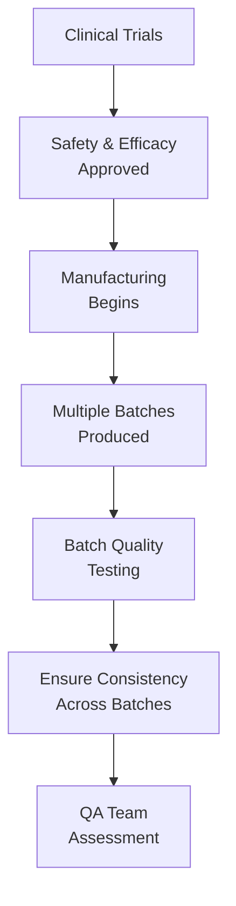
```mermaid
flowchart TD
    A[Clinical Trials] --> B["Safety & Efficacy<br/>Approved"]
    B --> C["Manufacturing<br/>Begins"]
    C --> D["Multiple Batches<br/>Produced"]
    D --> E["Batch Quality<br/>Testing"]
    E --> F["Ensure Consistency<br/>Across Batches"]
    F --> G["QA Team<br/>Assessment"]
```

2. **What's the difference between "satisfactory job" and "clinical effectiveness"?**
   - Clinical effectiveness is proven in trials; "satisfactory job" here means no symptoms/side effects after 14 days - a practical quality metric.

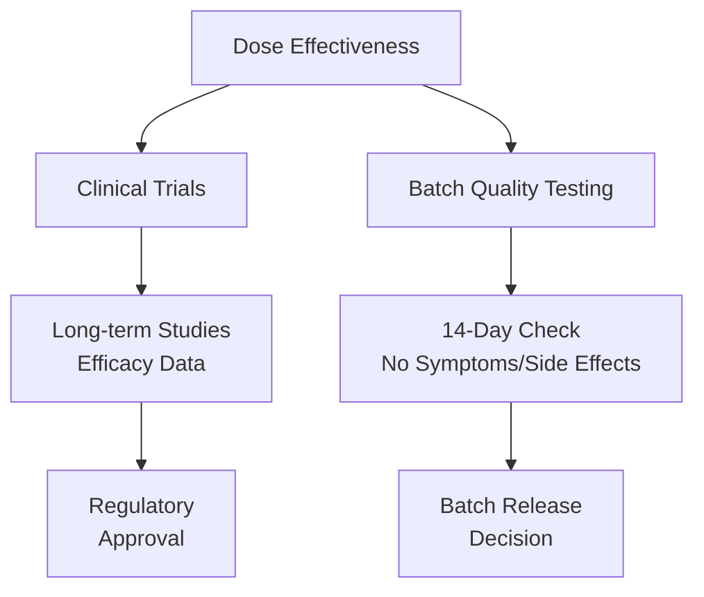
```mermaid
graph TD
    A[Dose Effectiveness] --> B[Clinical Trials]
    A --> C[Batch Quality Testing]
    B --> D["Long-term Studies<br/>Efficacy Data"]
    C --> E["14-Day Check<br/>No Symptoms/Side Effects"]
    D --> F["Regulatory<br/>Approval"]
    E --> G["Batch Release<br/>Decision"]
```

3. **Why test 100 volunteers when 200,000 doses were already administered?**
   - Testing every dose is impossible; sampling 100 provides statistical confidence about batch quality without testing all 40,000 units.

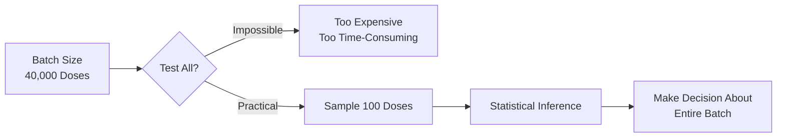
```mermaid
flowchart LR
    A["Batch Size<br/>40,000 Doses"] --> B{Test All?}
    B -->|Impossible| C["Too Expensive<br/>Too Time-Consuming"]
    B -->|Practical| D[Sample 100 Doses]
    D --> E[Statistical Inference]
    E --> F["Make Decision About<br/>Entire Batch"]
```

## BINOMIAL DISTRIBUTION FOR DOSE QUALITY

### Fundamentals - Why Binomial?

4. **Why is dose quality (satisfactory/unsatisfactory) modeled as Binomial?**
   - Each dose has two outcomes (satisfactory/unsatisfactory), fixed number of trials (n doses), independence between doses, and constant probability p.

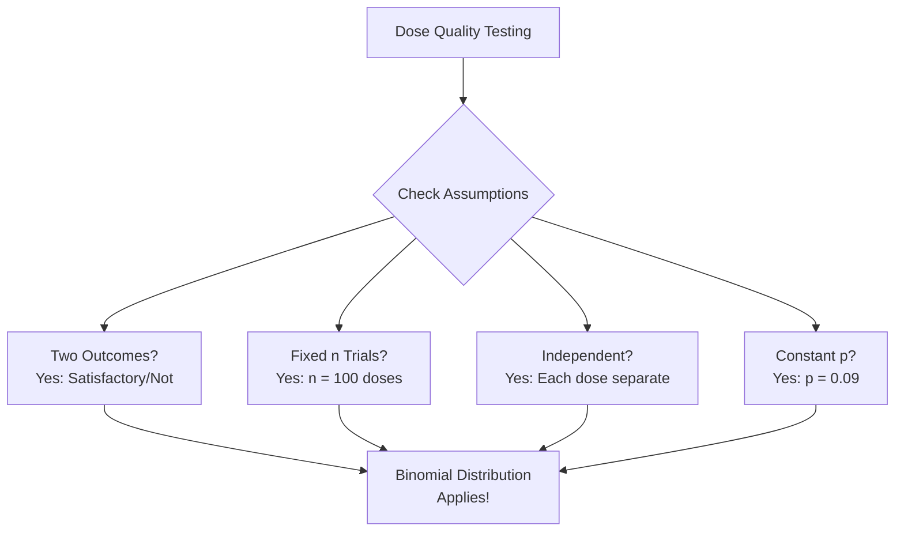
```mermaid
flowchart TD
    A[Dose Quality Testing] --> B{Check Assumptions}
    B --> C["Two Outcomes?<br/>Yes: Satisfactory/Not"]
    B --> D["Fixed n Trials?<br/>Yes: n = 100 doses"]
    B --> E["Independent?<br/>Yes: Each dose separate"]
    B --> F["Constant p?<br/>Yes: p = 0.09"]
    C & D & E & F --> G["Binomial Distribution<br/>Applies!"]
```

5. **How did they calculate p = 0.09 (probability of unsatisfactory dose)?**
   - If satisfactory is 10 times more likely than unsatisfactory: p + 10p = 1, so 11p = 1, giving p = 1/11 ≈ 0.09.

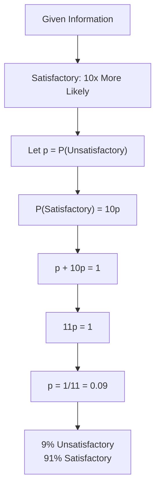
```mermaid
graph TD
    A[Given Information] --> B[Satisfactory: 10x More Likely]
    B --> C["Let p = P(Unsatisfactory)"]
    C --> D["P(Satisfactory) = 10p"]
    D --> E["p + 10p = 1"]
    E --> F["11p = 1"]
    F --> G["p = 1/11 = 0.09"]
    G --> H["9% Unsatisfactory<br/>91% Satisfactory"]
```

6. **What if the probability changes between batches? Does Binomial still work?**
   - No! Binomial requires constant p. If probability varies, you'd need different models or test each batch separately.

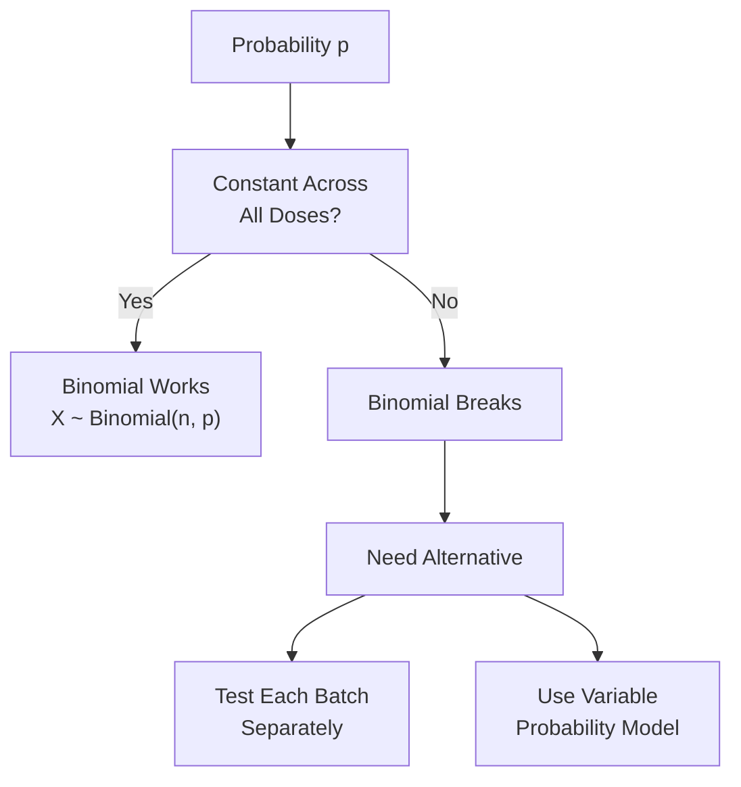
```mermaid
flowchart TD
    A[Probability p] --> B["Constant Across<br/>All Doses?"]
    B -->|Yes| C["Binomial Works<br/>X ~ Binomial(n, p)"]
    B -->|No| D[Binomial Breaks]
    D --> E[Need Alternative]
    E --> F["Test Each Batch<br/>Separately"]
    E --> G["Use Variable<br/>Probability Model"]
```

### Practical Applications

7. **Why calculate "exactly 3 unsatisfactory doses" - isn't that too specific?**
   - Exact probabilities help understand the distribution shape and identify most likely outcomes; they're building blocks for "at most" and "at least" calculations.

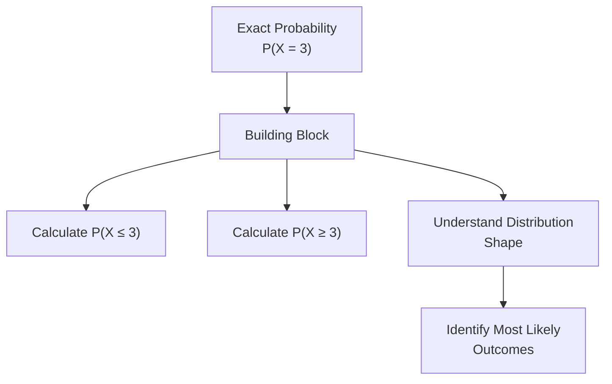
```mermaid
graph TD
    A["Exact Probability<br/>P(X = 3)"] --> B[Building Block]
    B --> C["Calculate P(X ≤ 3)"]
    B --> D["Calculate P(X ≥ 3)"]
    B --> E["Understand Distribution<br/>Shape"]
    E --> F["Identify Most Likely<br/>Outcomes"]
```

8. **What does "at most 3 unsatisfactory doses" mean in business terms?**
   - It means 0, 1, 2, or 3 failures - the probability that quality is acceptable (few failures). Helps QA decide if batch meets quality standards.

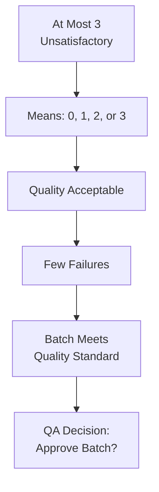
```mermaid
flowchart TD
    A["At Most 3<br/>Unsatisfactory"] --> B[Means: 0, 1, 2, or 3]
    B --> C[Quality Acceptable]
    C --> D[Few Failures]
    D --> E["Batch Meets<br/>Quality Standard"]
    E --> F["QA Decision:<br/>Approve Batch?"]
```

9. **Why is "at least 30 failures" important for the New York City order?**
   - It quantifies worst-case risk: probability of having 30+ failures out of 200 doses. Helps assess if order size is safe and if additional quality measures are needed.

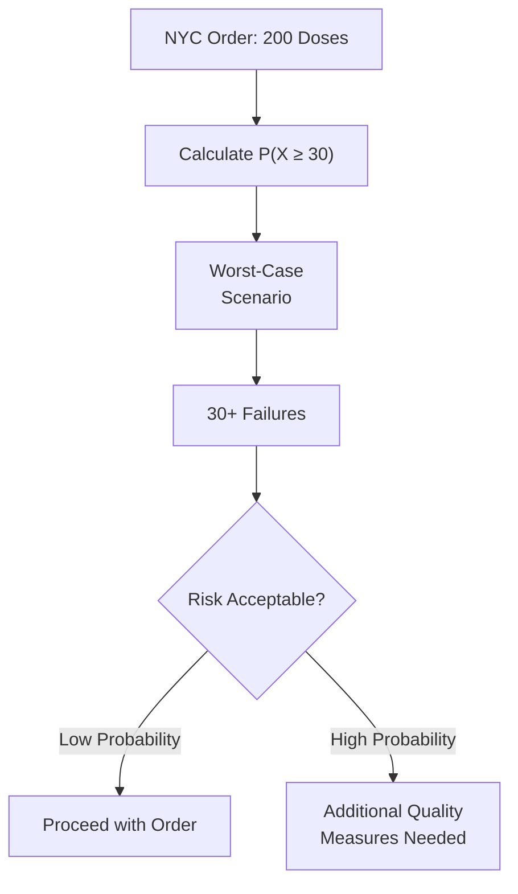
```mermaid
graph TD
    A[NYC Order: 200 Doses] --> B["Calculate P(X ≥ 30)"]
    B --> C["Worst-Case<br/>Scenario"]
    C --> D[30+ Failures]
    D --> E{Risk Acceptable?}
    E -->|Low Probability| F[Proceed with Order]
    E -->|High Probability| G["Additional Quality<br/>Measures Needed"]
```

10. **How does sample size (100 vs 200) affect the probability calculations?**
    - Larger samples (n=200) have more variability in outcomes but tighter distribution around np. The shape changes: wider spread but more predictable average.

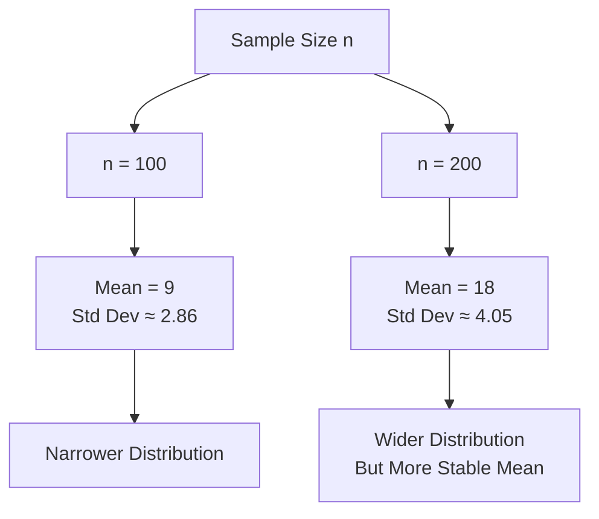
```mermaid
graph TD
    A[Sample Size n] --> B["n = 100"]
    A --> C["n = 200"]
    B --> D["Mean = 9<br/>Std Dev ≈ 2.86"]
    C --> E["Mean = 18<br/>Std Dev ≈ 4.05"]
    D --> F[Narrower Distribution]
    E --> G["Wider Distribution<br/>But More Stable Mean"]
```

## NORMAL DISTRIBUTION FOR TIME OF EFFECT

### Fundamentals

11. **Why assume time of effect follows Normal distribution with only 50 samples?**
   - With n=50, we can't verify normality perfectly, but we assume it for practical calculations. The Central Limit Theorem suggests sample means are normal, and many biological processes approximate normal.

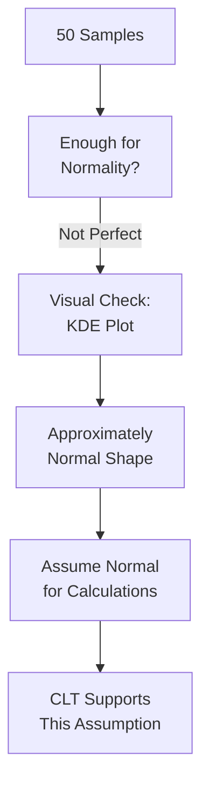
```mermaid
flowchart TD
    A[50 Samples] --> B["Enough for<br/>Normality?"]
    B -->|Not Perfect| C["Visual Check:<br/>KDE Plot"]
    C --> D["Approximately<br/>Normal Shape"]
    D --> E["Assume Normal<br/>for Calculations"]
    E --> F["CLT Supports<br/>This Assumption"]
```

12. **What if the time of effect data is skewed? Can we still use Normal?**
   - Skewed data violates normality assumption. You'd need transformations (log-normal) or non-parametric methods. The analysis might be inaccurate.

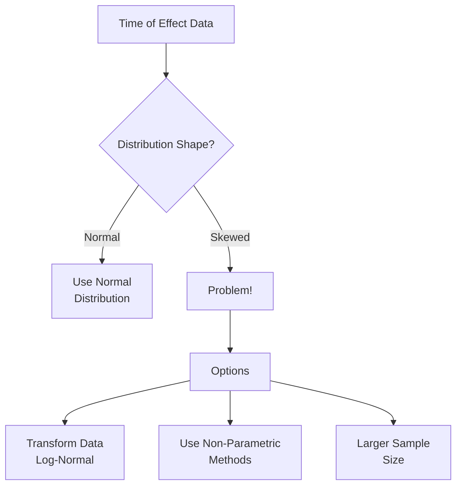
```mermaid
graph TD
    A[Time of Effect Data] --> B{Distribution Shape?}
    B -->|Normal| C["Use Normal<br/>Distribution"]
    B -->|Skewed| D[Problem!]
    D --> E[Options]
    E --> F["Transform Data<br/>Log-Normal"]
    E --> G["Use Non-Parametric<br/>Methods"]
    E --> H["Larger Sample<br/>Size"]
```

13. **Why estimate population mean from sample mean? Isn't sample mean just an estimate?**
   - Yes, it's an estimate! But with proper statistical methods (confidence intervals), we quantify the uncertainty and make reliable inferences about the true population mean.

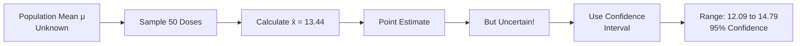
```mermaid
flowchart LR
    A["Population Mean μ<br/>Unknown"] --> B[Sample 50 Doses]
    B --> C["Calculate x̄ = 13.44"]
    C --> D[Point Estimate]
    D --> E[But Uncertain!]
    E --> F["Use Confidence<br/>Interval"]
    F --> G["Range: 12.09 to 14.79<br/>95% Confidence"]
```

### Practical Applications

14. **What does "probability time < 11.5 hours = 0.34" mean for patients?**
   - About 34% of doses take less than 11.5 hours to become effective. Patients can expect faster effectiveness about 1 in 3 times.

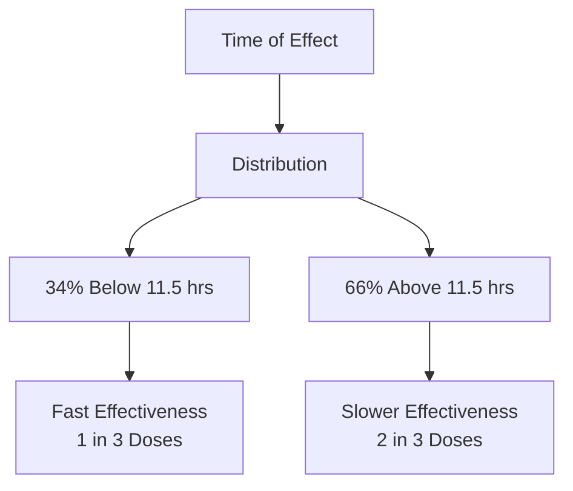
```mermaid
graph TD
    A[Time of Effect] --> B[Distribution]
    B --> C[34% Below 11.5 hrs]
    B --> D[66% Above 11.5 hrs]
    C --> E["Fast Effectiveness<br/>1 in 3 Doses"]
    D --> F["Slower Effectiveness<br/>2 in 3 Doses"]
```

15. **Why calculate the 90th percentile (19.52 hours)? What's its business value?**
   - 90% of doses are effective within 19.52 hours. Helps set patient expectations, plan follow-up schedules, and identify outliers needing attention.

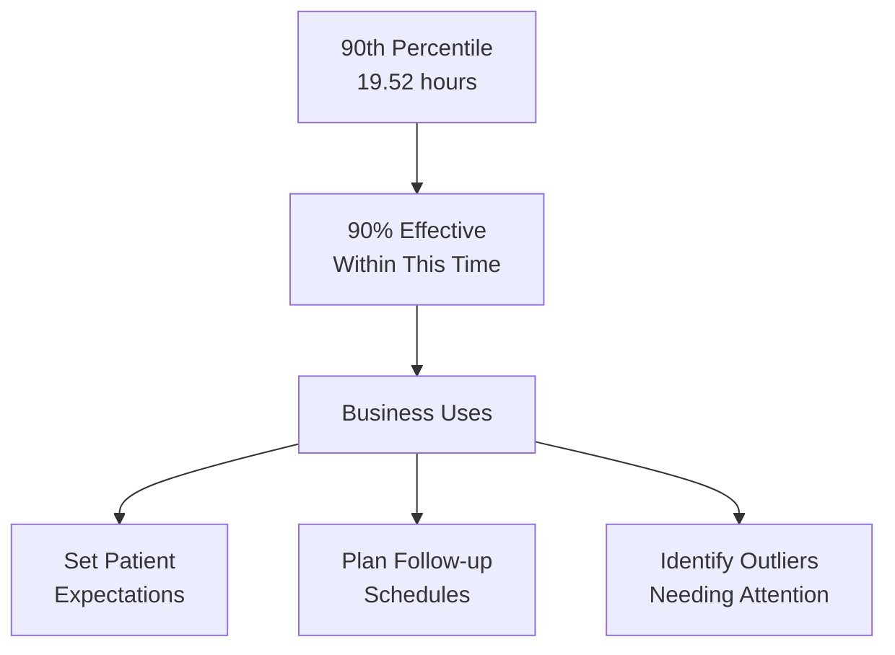
```mermaid
flowchart TD
    A["90th Percentile<br/>19.52 hours"] --> B["90% Effective<br/>Within This Time"]
    B --> C[Business Uses]
    C --> D["Set Patient<br/>Expectations"]
    C --> E["Plan Follow-up<br/>Schedules"]
    C --> F["Identify Outliers<br/>Needing Attention"]
```

16. **How do manufacturers use percentiles for quality control?**
   - Percentiles define acceptable ranges: if 95th percentile exceeds threshold, investigate. They help set specifications and monitor process capability.

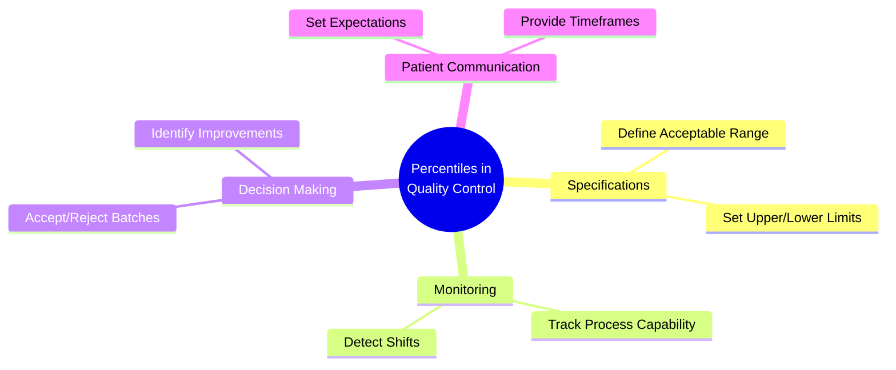
```mermaid
mindmap
    root((Percentiles in<br/>Quality Control))
        Specifications
            Define Acceptable Range
            Set Upper/Lower Limits
        Monitoring
            Track Process Capability
            Detect Shifts
        Decision Making
            Accept/Reject Batches
            Identify Improvements
        Patient Communication
            Set Expectations
            Provide Timeframes
```

## CONFIDENCE INTERVALS

### Fundamentals

17. **Why use t-distribution instead of z-distribution for confidence intervals?**
   - Population standard deviation σ is unknown (we only have sample s). With small samples (n=50), t-distribution accounts for extra uncertainty from estimating σ.

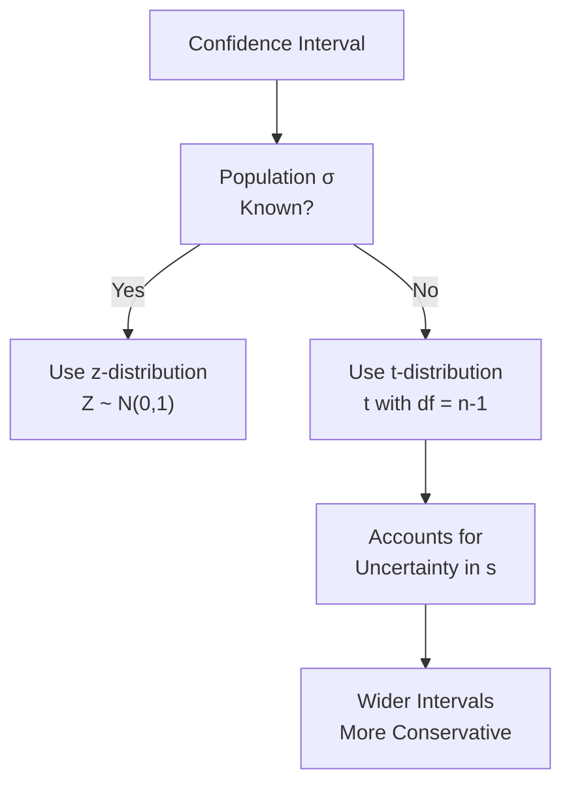
```mermaid
flowchart TD
    A[Confidence Interval] --> B["Population σ<br/>Known?"]
    B -->|Yes| C["Use z-distribution<br/>Z ~ N(0,1)"]
    B -->|No| D["Use t-distribution<br/>t with df = n-1"]
    D --> E["Accounts for<br/>Uncertainty in s"]
    E --> F["Wider Intervals<br/>More Conservative"]
```

18. **What does "95% confidence" actually mean for the time of effect?**
   - If we repeated this sampling 100 times, about 95 of the calculated intervals would contain the true population mean. The single interval either does or doesn't - we don't know which.

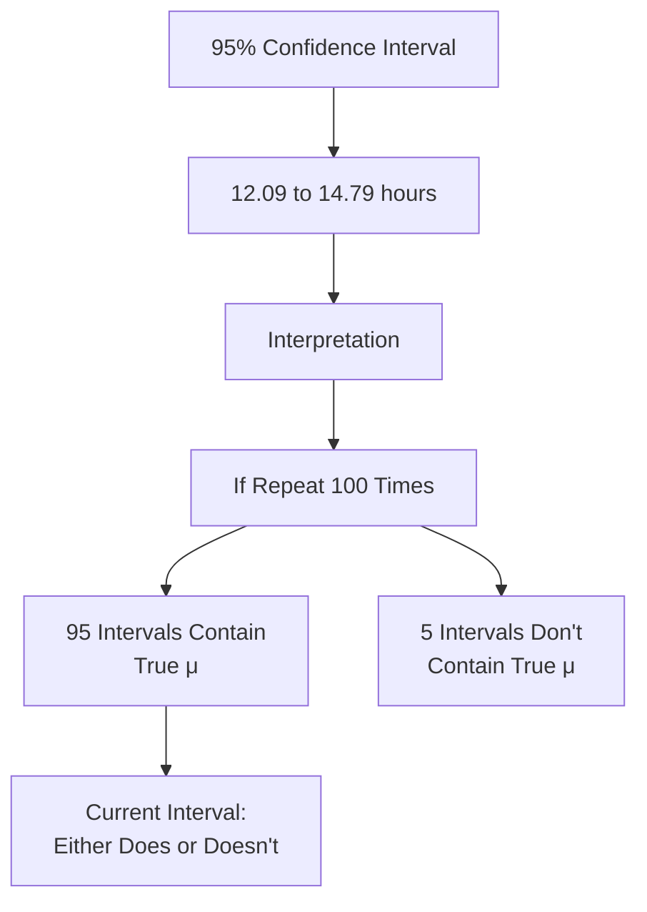
```mermaid
graph TD
    A[95% Confidence Interval] --> B[12.09 to 14.79 hours]
    B --> C[Interpretation]
    C --> D[If Repeat 100 Times]
    D --> E["95 Intervals Contain<br/>True μ"]
    D --> F["5 Intervals Don't<br/>Contain True μ"]
    E --> G["Current Interval:<br/>Either Does or Doesn't"]
```

19. **Why is the confidence interval (12.09, 14.79) wider than just saying "mean = 13.44"?**
   - The interval acknowledges uncertainty. Point estimate (13.44) is precise but possibly wrong; interval shows we're 95% confident the true mean lies in this range.

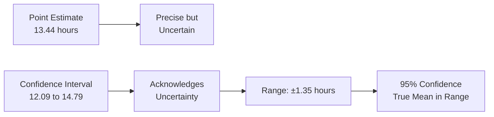
```mermaid
graph LR
    A["Point Estimate<br/>13.44 hours"] --> B["Precise but<br/>Uncertain"]
    C["Confidence Interval<br/>12.09 to 14.79"] --> D["Acknowledges<br/>Uncertainty"]
    D --> E["Range: ±1.35 hours"]
    E --> F["95% Confidence<br/>True Mean in Range"]
```

20. **What happens to confidence interval width if we increase sample size?**
   - Larger samples give narrower intervals (more precision). The margin of error decreases as √n increases, making estimates more reliable.

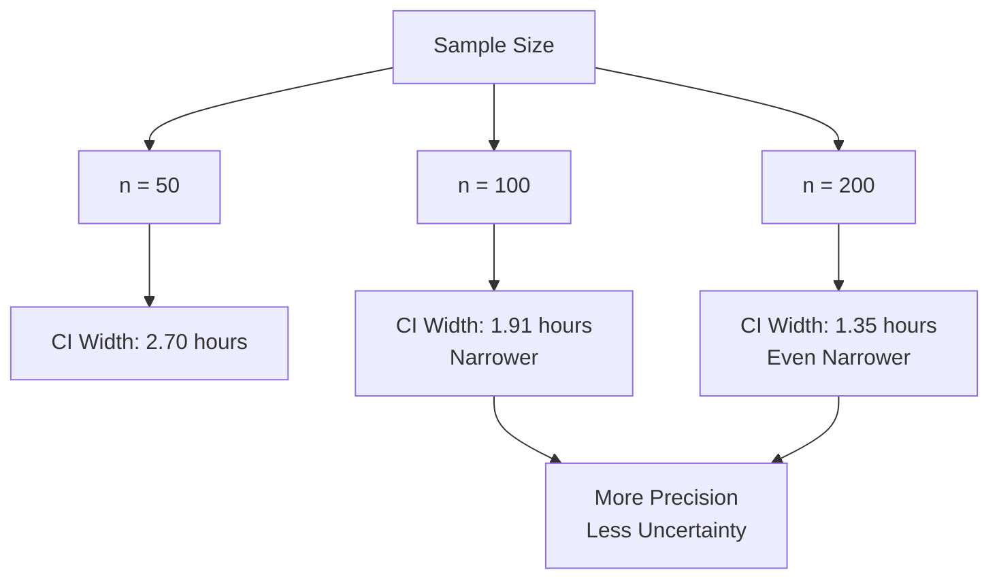
```mermaid
flowchart TD
    A[Sample Size] --> B["n = 50"]
    A --> C["n = 100"]
    A --> D["n = 200"]
    B --> E[CI Width: 2.70 hours]
    C --> F["CI Width: 1.91 hours<br/>Narrower"]
    D --> G["CI Width: 1.35 hours<br/>Even Narrower"]
    F --> H["More Precision<br/>Less Uncertainty"]
    G --> H
```

### Practical Applications

21. **How does QA team use confidence intervals to make batch decisions?**
   - If confidence interval falls within acceptable range (e.g., 10-15 hours), approve batch. If interval includes unacceptable values, investigate or reject.

```mermaid
flowchart TD
    A["Calculate 95% CI<br/>12.09 to 14.79 hrs"] --> B{Within Acceptable<br/>Range?} --> B["Within Acceptable<br/>Range?"]
    B -->|Yes: 10-15 hrs| C[Approve Batch]
    B -->|No: Includes <10 or >15| D[Investigate]
    D --> E{Can Fix?}
    E -->|Yes| F[Corrective Action]
    E -->|No| G[Reject Batch]
```

22. **Why is 95% confidence standard? Why not 99% or 90%?**
   - 95% balances precision and confidence: 99% gives wider intervals (less useful), 90% gives narrower intervals (less confident). 95% is conventional compromise.

```mermaid
graph TD
    A[Confidence Level] --> B[90% Confidence]
    A --> C[95% Confidence]
    A --> D[99% Confidence]
    B --> E["Narrow Interval<br/>Less Confident"]
    C --> F["Balanced<br/>Conventional"]
    D --> G["Wide Interval<br/>Very Confident"]
    F --> H[Industry Standard]
```

23. **Can confidence intervals help predict individual patient response times?**
   - No! CI is for population mean, not individual predictions. For individuals, use the distribution (Normal with μ=13.44, σ=4.75) to find probabilities.

```mermaid
flowchart TD
    A[Statistical Inference] --> B["Population Mean μ<br/>CI: 12.09 to 14.79"]
    A --> C[Individual Prediction]
    B --> D["About Average<br/>Across All Patients"]
    C --> E["Use Distribution<br/>N(13.44, 4.75²)"]
    E --> F["P(Time < 11.5) = 0.34<br/>For One Patient"]
```

## ASSUMPTIONS AND LIMITATIONS

### Critical Thinking

24. **What if doses aren't independent? Does Binomial break?**
   - Yes! If one dose's failure affects others (contamination, batch issues), independence is violated. Need different models accounting for dependence.

```mermaid
graph TD
    A[Dose Independence] --> B["Are Doses<br/>Independent?"]
    B -->|Yes| C["Binomial Works<br/>X ~ Binomial(n,p)"]
    B -->|No| D[Independence Violated]
    D --> E[Possible Causes]
    E --> F["Contamination<br/>Batch Issues"]
    E --> G["Storage Problems<br/>Temperature"]
    D --> H["Need Different Model<br/>Account for Dependence"]
```

25. **What if the "10 times more likely" ratio changes over time?**
   - The probability p would change, violating Binomial's constant probability assumption. You'd need to test each batch separately or use time-varying models.

```mermaid
flowchart TD
    A[Probability Ratio] --> B["Constant Over<br/>Time?"]
    B -->|Yes: 10:1 Always| C["Binomial Works<br/>p = 0.09 Constant"]
    B -->|No: Changes| D[Problem!]
    D --> E[p Varies]
    E --> F["Test Each Batch<br/>Separately"]
    E --> G["Use Time-Varying<br/>Probability Model"]
```

26. **Why assume Normal distribution when we only have 50 samples?**
   - It's an assumption based on: (1) biological processes often normal, (2) visual check shows approximate normality, (3) CLT supports it. But it's an assumption - verify with larger samples if critical.

```mermaid
mindmap
    root((Normality<br/>Assumption))
        Justification
            Biological Processes Often Normal
            Visual Check Shows Approximate Shape
            CLT Supports Sample Means
        Risk
            Only 50 Samples
            May Not Be Perfectly Normal
            Could Be Skewed
        Mitigation
            Check with Larger Sample
            Use Transformations if Needed
            Consider Non-Parametric Methods
```

27. **What if the sample of 50 volunteers isn't representative?**
   - Non-representative samples lead to biased estimates. Confidence intervals would be wrong, and conclusions invalid. Random sampling is crucial!

```mermaid
flowchart TD
    A[Sampling Method] --> B["Random &<br/>Representative?"]
    B -->|Yes| C["Valid Inference<br/>CI Reliable"]
    B -->|No| D[Biased Sample]
    D --> E[Wrong Estimates]
    E --> F[Invalid CI]
    F --> G[Wrong Conclusions]
    G --> H[Bad Decisions]
```

## BUSINESS DECISION MAKING

### Connecting Statistics to Actions

28. **How does P(X ≤ 3) = 1.73% help QA make decisions?**
   - Very low probability of ≤3 failures suggests batch is high quality. If threshold is "accept if ≤5 failures", 1.73% is well below, supporting approval.

```mermaid
graph TD
    A["P(X ≤ 3) = 1.73%"] --> B["Very Low<br/>Probability"]
    B --> C{Quality Threshold?}
    C -->|Accept if ≤5 failures| D["1.73% << 5%<br/>Well Below Threshold"]
    D --> E["Strong Evidence<br/>High Quality"]
    E --> F["Recommend<br/>Batch Approval"]
```

29. **Why is P(X ≥ 30) = 0.3% important for the NYC order?**
   - Extremely low probability (0.3%) means risk is minimal. NYC can proceed confidently. If probability were high (e.g., 20%), they'd need guarantees or alternatives.

```mermaid
flowchart TD
    A[NYC Order Risk] --> B["P(X ≥ 30) = 0.3%"]
    B --> C{Interpretation}
    C --> D["Extremely Low Risk<br/>0.3% Chance"]
    D --> E{Risk Acceptable?}
    E -->|Yes: Very Low| F["Proceed with Order<br/>Confidently"]
    E -->|No: If High| G["Request Guarantees<br/>or Alternatives"]
```

30. **How do confidence intervals help with production planning?**
   - CI (12.09-14.79 hours) tells manufacturers: "Most doses effective within ~13 hours on average." Helps plan patient follow-ups, set expectations, schedule monitoring.

```mermaid
mindmap
    root((CI for<br/>Production Planning))
        Patient Management
            Schedule Follow-ups
            Set Expectations
            Plan Monitoring
        Quality Control
            Set Specifications
            Monitor Process
            Detect Shifts
        Communication
            Inform Healthcare Providers
            Update Patient Materials
            Regulatory Reporting
```

## STATISTICAL CONCEPTS DEEP DIVE

### Understanding the Math

31. **Why use binom.cdf() for "at most" calculations instead of summing PMF values?**
   - CDF is faster and more accurate. Summing many PMF values can accumulate rounding errors. CDF uses optimized algorithms designed for cumulative probabilities.

```mermaid
graph TD
    A["At Most 3<br/>P(X ≤ 3)"] --> B{Calculation Method}
    B --> C["Sum PMF:<br/>P(0)+P(1)+P(2)+P(3)"]
    B --> D["Use CDF:<br/>binom.cdf(3)"]
    C --> E["Slower<br/>Rounding Errors"]
    D --> F["Faster<br/>More Accurate"]
    F --> G[Preferred Method]
```

32. **What's the relationship between "at least 30" and "at most 29"?**
   - They're complements! P(X ≥ 30) = 1 - P(X ≤ 29). Calculating "at most 29" and subtracting from 1 gives "at least 30" probability.

```mermaid
flowchart LR
    A["At Least 30<br/>P(X ≥ 30)"] --> B[Complement Rule]
    B --> C["1 - P(X ≤ 29)"]
    C --> D["At Most 29<br/>P(X ≤ 29)"]
    D --> E["Use CDF:<br/>binom.cdf(29)"]
    E --> F[Subtract from 1]
    F --> A
```

33. **Why does Normal distribution need both mean AND standard deviation?**
   - Mean tells you center (where most values cluster), standard deviation tells you spread (how variable). Both are needed to fully describe the distribution and calculate probabilities.

```mermaid
graph TD
    A[Normal Distribution] --> B[Two Parameters]
    B --> C["Mean μ = 13.44<br/>Center/Location"]
    B --> D["Std Dev σ = 4.75<br/>Spread/Variability"]
    C --> E["Where Values<br/>Cluster"]
    D --> F["How Much<br/>Variation"]
    E & F --> G["Complete Description<br/>Calculate Probabilities"]
```

34. **What's the difference between norm.cdf() and norm.ppf()?**
   - cdf: given value, find probability (P(X < 11.5) = 0.34). ppf: given probability, find value (90th percentile = 19.52 hours). They're inverse functions.

```mermaid
flowchart TD
    A[Normal Functions] --> B["norm.cdf()"]
    A --> C["norm.ppf()"]
    B --> D["Input: Value<br/>11.5 hours"]
    D --> E["Output: Probability<br/>0.34"]
    C --> F["Input: Probability<br/>0.90"]
    F --> G["Output: Value<br/>19.52 hours"]
    E --> H["Inverse<br/>Functions"]
    G --> H
```

35. **Why use degrees of freedom (df = n-1) in t-distribution?**
   - We estimated σ from sample (lost 1 degree of freedom). With n-1 df, t-distribution accounts for this estimation uncertainty, giving correct confidence intervals.

```mermaid
graph TD
    A[Degrees of Freedom] --> B["df = n - 1"]
    B --> C[Why n-1?]
    C --> D["Estimated σ from Sample"]
    D --> E["Lost 1 Degree<br/>of Freedom"]
    E --> F["t-distribution<br/>Accounts for This"]
    F --> G["Correct CI<br/>Width"]
```

## REAL-WORLD IMPLICATIONS

### Beyond the Numbers

36. **What if the 90th percentile (19.52 hours) exceeds a safety threshold?**
   - If threshold is 18 hours, 19.52 exceeds it - 10% of doses take too long. QA must investigate: is this acceptable? Can process be improved?

```mermaid
flowchart TD
    A["90th Percentile<br/>19.52 hours"] --> B{Safety Threshold?}
    B -->|18 hours| C["19.52 > 18<br/>Exceeds Threshold"]
    B -->|20 hours| D["19.52 < 20<br/>Within Threshold"]
    C --> E["10% of Doses<br/>Too Slow"]
    E --> F[Investigate Cause]
    F --> G{Acceptable?}
    G -->|No| H["Improve Process<br/>or Reject Batch"]
```

37. **How do these statistics help Medicon price the doses?**
   - High quality (low failure rate) and consistent effectiveness (narrow CI) justify premium pricing. Poor quality or high variability reduces pricing power.

```mermaid
graph TD
    A[Statistical Results] --> B[Quality Metrics]
    A --> C[Effectiveness Metrics]
    B --> D["Low Failure Rate<br/>P(X≤3) = 1.73%"]
    C --> E["Consistent Time<br/>CI: 12.09-14.79"]
    D --> F[High Quality]
    E --> G[Reliable]
    F & G --> H["Premium Pricing<br/>Justified"]
```

38. **What happens if confidence interval doesn't meet regulatory requirements?**
   - If CI (12.09-14.79) includes unacceptable values (e.g., >15 hours), batch may not meet standards. Need larger sample, process improvement, or batch rejection.

```mermaid
flowchart TD
    A["95% CI<br/>12.09 to 14.79 hrs"] --> B{Regulatory<br/>Requirement?} --> B["Regulatory<br/>Requirement?"]
    B -->|Must be <15 hrs| C["CI Within Range<br/>12.09-14.79 < 15"]
    C --> D["Meets Requirement<br/>Approve"]
    B -->|Must be <12 hrs| E["CI Exceeds Range<br/>14.79 > 12"]
    E --> F["Doesn't Meet<br/>Requirement"]
    F --> G[Options]
    G --> H["Larger Sample<br/>Narrower CI"]
    G --> I[Improve Process]
    G --> J[Reject Batch]
```

39. **How can QA use these results to improve future batches?**
   - If failure rate higher than expected, investigate causes. If time of effect too variable, improve manufacturing consistency. Statistics guide where to focus improvement efforts.

```mermaid
mindmap
    root((Using Statistics<br/>for Improvement))
        Failure Rate Analysis
            Compare Actual to Expected
            Identify Root Causes
            Target Improvements
        Time Variability
            Reduce Standard Deviation
            Improve Consistency
            Better Process Control
        Continuous Monitoring
            Track Trends Across Batches
            Detect Shifts Early
            Prevent Problems
```

40. **What's the cost of being wrong? Type I vs Type II errors in batch testing?**
   - Type I: Reject good batch (waste money, delay deployment). Type II: Accept bad batch (patient harm, reputation damage, lawsuits). Type II is usually worse!

```mermaid
graph TD
    A[Batch Decision] --> B{True Quality?}
    B -->|Good Batch| C[Accept: Correct]
    B -->|Good Batch| D["Reject: Type I Error<br/>Waste Money"]
    B -->|Bad Batch| E["Accept: Type II Error<br/>Patient Harm"]
    B -->|Bad Batch| F[Reject: Correct]
    D --> G[Cost: Financial Loss]
    E --> H["Cost: Human Safety<br/>Much Worse!"]
```

## ADVANCED CONSIDERATIONS

### Going Deeper

41. **Why not test all 40,000 doses instead of sampling?**
   - Testing is destructive (dose consumed) or expensive. Sampling 100 gives statistical confidence at fraction of cost. Testing all would leave no doses to sell!

```mermaid
flowchart TD
    A[Batch: 40,000 Doses] --> B{Test All?}
    B -->|Yes| C[Problems]
    C --> D["Destructive Testing<br/>Doses Consumed"]
    C --> E["Very Expensive<br/>Time-Consuming"]
    C --> F["No Doses Left<br/>to Sell!"]
    B -->|No: Sample| G[Test 100 Doses]
    G --> H[Statistical Confidence]
    H --> I["39,900 Doses<br/>Available"]
```

42. **How does batch size (40,000) affect the sampling strategy?**
   - Larger batches allow smaller sample percentages while maintaining statistical power. For 40,000, 100 samples (0.25%) is sufficient due to large population size.

```mermaid
graph TD
    A[Batch Size] --> B[40,000 Doses]
    B --> C["Sample Size<br/>n = 100"]
    C --> D["Sample Percentage<br/>0.25%"]
    D --> E{Sufficient?}
    E -->|Yes| F["Large Population<br/>Small % OK"]
    E -->|No: If Small Batch| G["Need Larger<br/>Sample %"]
```

43. **What if the 50 volunteers aren't representative of the target population?**
   - Results become biased. If volunteers are healthier/younger than target, time of effect estimates may be optimistic. Need stratified sampling for different demographics.

```mermaid
flowchart TD
    A[50 Volunteers] --> B["Representative<br/>of Target?"]
    B -->|Yes| C["Valid Inference<br/>Results Apply"]
    B -->|No| D[Biased Sample]
    D --> E["Example: All Young<br/>Healthy Volunteers"]
    E --> F["Time Estimates<br/>Too Optimistic"]
    F --> G["Wrong for Elderly<br/>or Sick Patients"]
    G --> H["Need Stratified<br/>Sampling"]
```

44. **How do you verify Binomial assumptions in practice?**
   - Check independence: random sampling, no batch contamination. Check constant p: compare failure rates across subgroups. Check two outcomes: clearly define satisfactory/unsatisfactory.

```mermaid
mindmap
    root((Verifying<br/>Binomial Assumptions))
        Two Outcomes
            Clear Definition
            No Ambiguity
            Consistent Criteria
        Fixed n
            Sample Size Known
            No Missing Data
        Independence
            Random Sampling
            No Contamination
            Separate Doses
        Constant p
            Compare Subgroups
            Check Over Time
            Statistical Tests
```

45. **What if time of effect data shows outliers? How does that affect analysis?**
   - Outliers can skew mean and widen confidence intervals. Investigate: measurement error? Special cases? Remove if errors, keep if real but report separately. Consider robust methods.

```mermaid
flowchart TD
    A[Time of Effect Data] --> B["Outliers<br/>Present?"]
    B -->|No| C[Proceed Normally]
    B -->|Yes| D[Investigate]
    D --> E["Measurement<br/>Error?"]
    E -->|Yes| F["Remove Outlier<br/>Correct Data"]
    E -->|No: Real Value| G["Keep but Report<br/>Separately"]
    G --> H["Consider Robust<br/>Methods"]
    F --> I["Recalculate<br/>Statistics"]
    H --> I
```

## CONNECTING CONCEPTS

### Integration

46. **How do Binomial and Normal distributions work together in this case study?**
   - Binomial models discrete quality (satisfactory/not), Normal models continuous time. They're separate but complementary: quality affects deployment, time affects patient expectations.

```mermaid
graph TD
    A[Medicon Analysis] --> B[Binomial Distribution]
    A --> C[Normal Distribution]
    B --> D["Quality: Satisfactory/Not<br/>Discrete Outcomes"]
    C --> E["Time of Effect<br/>Continuous Variable"]
    D --> F["Batch Approval<br/>Decision"]
    E --> G["Patient Expectations<br/>Planning"]
    F & G --> H["Complete Picture<br/>for Decision Making"]
```

47. **Why use different statistical methods for different questions?**
   - Each question needs appropriate method: Binomial for counts (failures), Normal for continuous (time), t-distribution for means with unknown σ. Right tool for right job!

```mermaid
mindmap
    root((Statistical<br/>Methods))
        Binomial
            Count Data
            Success/Failure
            Fixed Trials
        Normal
            Continuous Data
            Known Parameters
            Individual Values
        t-Distribution
            Sample Means
            Unknown σ
            Small Samples
```

48. **What's the relationship between sample size and confidence interval width?**
   - Inverse relationship: larger n → narrower CI (more precision). Doubling sample size doesn't halve width (it's √n relationship). Diminishing returns on precision.

```mermaid
graph TD
    A[Sample Size n] --> B["n = 50"]
    A --> C["n = 100"]
    A --> D["n = 200"]
    B --> E[CI Width: 2.70 hrs]
    C --> F["CI Width: 1.91 hrs<br/>29% Reduction"]
    D --> G["CI Width: 1.35 hrs<br/>50% Reduction"]
    H[Relationship] --> I["Width ∝ 1/√n<br/>Not Linear!"]
```

49. **How do probability and confidence intervals complement each other?**
   - Probabilities predict individual outcomes (P(X=3), P(time<11.5)). Confidence intervals estimate population parameters (μ in 12.09-14.79). Both needed for complete understanding.

```mermaid
flowchart LR
    A[Statistical Analysis] --> B[Probabilities]
    A --> C[Confidence Intervals]
    B --> D["Individual Outcomes<br/>P(X = k)<br/>P(time < t)"]
    C --> E["Population Parameters<br/>μ in CI<br/>True Mean Range"]
    D --> F["Predict Specific<br/>Events"]
    E --> G["Estimate Unknown<br/>Parameters"]
    F & G --> H["Complete<br/>Understanding"]
```

50. **What would you do differently if this were a clinical trial vs batch quality testing?**
   - Clinical trial: larger sample, control group, hypothesis testing, regulatory oversight. Batch testing: smaller sample, compare to specifications, faster decisions, internal QA focus.

```mermaid
graph TD
    A[Study Type] --> B[Clinical Trial]
    A --> C[Batch Quality Testing]
    B --> D["Large Sample<br/>n = 1000+"]
    B --> E["Control Group<br/>Placebo"]
    B --> F["Hypothesis Testing<br/>Regulatory"]
    C --> G["Small Sample<br/>n = 100"]
    C --> H["Compare to Specs<br/>No Control"]
    C --> I["Fast Decisions<br/>Internal QA"]
```

---

*Total Questions: 50*

**These questions cover:**
- **Fundamentals**: Why use Binomial/Normal, how assumptions work
- **Calculations**: Understanding PMF, CDF, percentiles, confidence intervals
- **Business Context**: How statistics inform decisions
- **Assumptions**: When methods break, how to verify
- **Integration**: How concepts connect
- **Critical Thinking**: Limitations, alternatives, real-world implications

Each question includes a Mermaid diagram to enhance visual learning and understanding of the statistical concepts in the pharmaceutical context.
