# Curious Learner Questions - Mobile Internet Usage Analysis Case Study
*Enhanced with Visual Diagrams*

## CASE STUDY CONTEXT

### Understanding the Problem

1. **Why test a company's claim about average mobile internet usage? What's the business value?**
   - Verifying claims helps make informed decisions: marketing strategies, product development, pricing models. If claim is wrong, decisions based on it will be flawed.

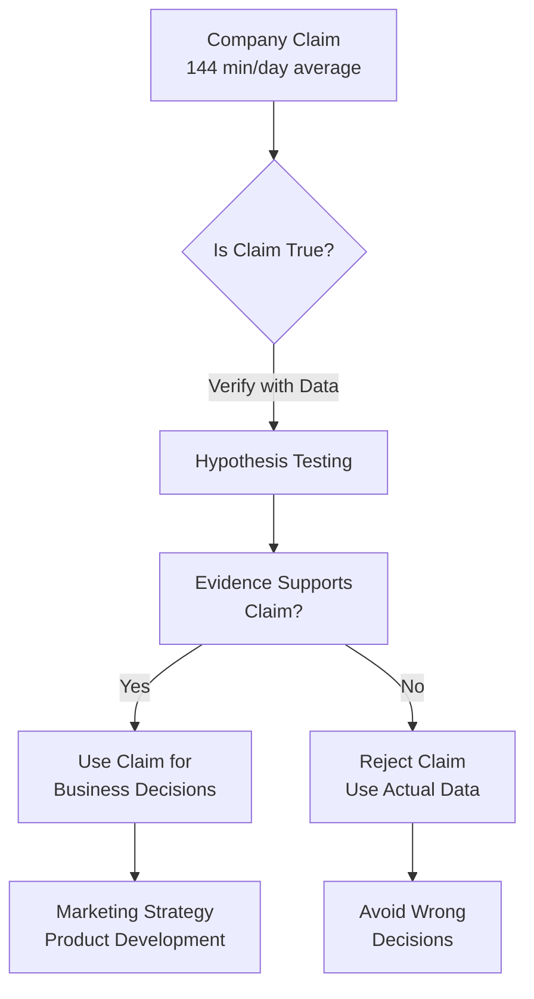
```mermaid
flowchart TD
    A["Company Claim<br/>144 min/day average"] --> B{Is Claim True?}
    B -->|Verify with Data| C[Hypothesis Testing]
    C --> D["Evidence Supports<br/>Claim?"]
    D -->|Yes| E["Use Claim for<br/>Business Decisions"]
    D -->|No| F["Reject Claim<br/>Use Actual Data"]
    E --> G["Marketing Strategy<br/>Product Development"]
    F --> H["Avoid Wrong<br/>Decisions"]
```

2. **Why use a sample of 30 friends and family instead of surveying all Americans?**
   - Surveying all Americans is impossible (330+ million people). A random sample of 30 provides statistical evidence at fraction of cost/time, with quantifiable uncertainty.

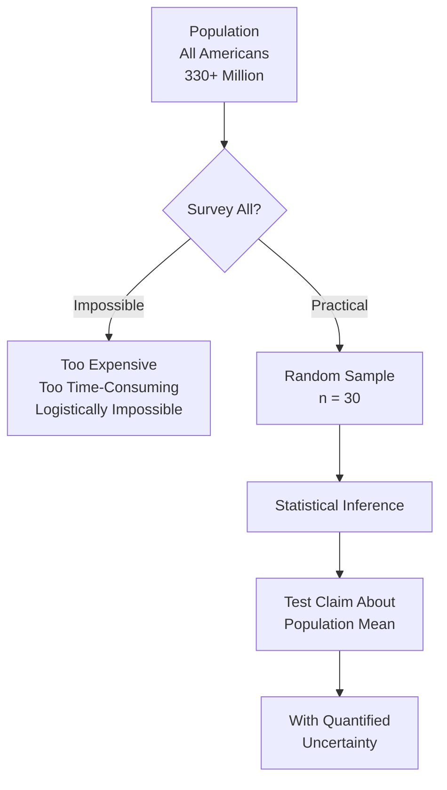
```mermaid
graph TD
    A["Population<br/>All Americans<br/>330+ Million"] --> B{Survey All?}
    B -->|Impossible| C["Too Expensive<br/>Too Time-Consuming<br/>Logistically Impossible"]
    B -->|Practical| D["Random Sample<br/>n = 30"]
    D --> E[Statistical Inference]
    E --> F["Test Claim About<br/>Population Mean"]
    F --> G["With Quantified<br/>Uncertainty"]
```

3. **What if the sample isn't truly random? How does that affect conclusions?**
   - Non-random sampling introduces bias. If friends/family aren't representative (e.g., all tech-savvy), results won't generalize to all Americans. Conclusions become invalid.

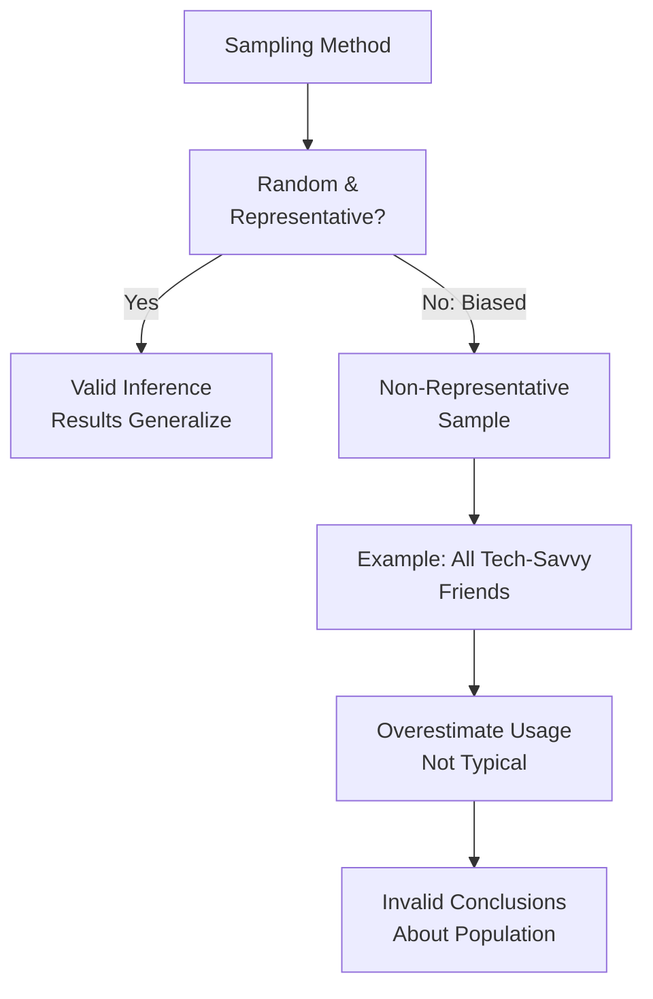
```mermaid
flowchart TD
    A[Sampling Method] --> B["Random &<br/>Representative?"]
    B -->|Yes| C["Valid Inference<br/>Results Generalize"]
    B -->|No: Biased| D["Non-Representative<br/>Sample"]
    D --> E["Example: All Tech-Savvy<br/>Friends"]
    E --> F["Overestimate Usage<br/>Not Typical"]
    F --> G["Invalid Conclusions<br/>About Population"]
```

## HYPOTHESIS TESTING FUNDAMENTALS

### Formulating Hypotheses

4. **Why is the null hypothesis "μ = 144" and not "μ ≠ 144"?**
   - Science tests by attempting to disprove. We assume the claim is true (null), then see if data provides strong evidence against it. Starting with "≠" would be proving a negative.

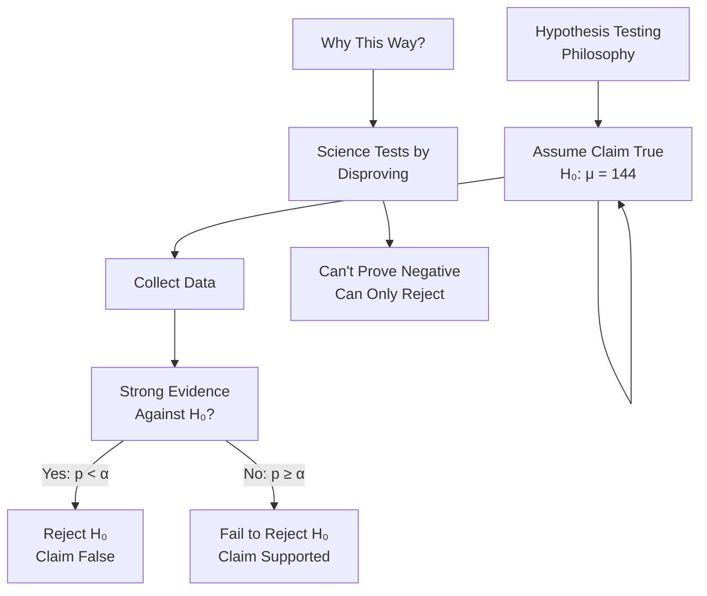
```mermaid
graph TD
    A["Hypothesis Testing<br/>Philosophy"] --> B[Assume Claim True<br/>H₀: μ = 144] --> B["Assume Claim True<br/>H₀: μ = 144"]
    B --> C[Collect Data]
    C --> D["Strong Evidence<br/>Against H₀?"]
    D -->|Yes: p < α| E["Reject H₀<br/>Claim False"]
    D -->|No: p ≥ α| F["Fail to Reject H₀<br/>Claim Supported"]
    G[Why This Way?] --> H["Science Tests by<br/>Disproving"]
    H --> I["Can't Prove Negative<br/>Can Only Reject"]
```

5. **Why use two-tailed test (μ ≠ 144) instead of one-tailed (μ > 144 or μ < 144)?**
   - Question asks if mean is "different" - could be higher OR lower. Two-tailed tests both directions. One-tailed would only test one direction, missing the other.

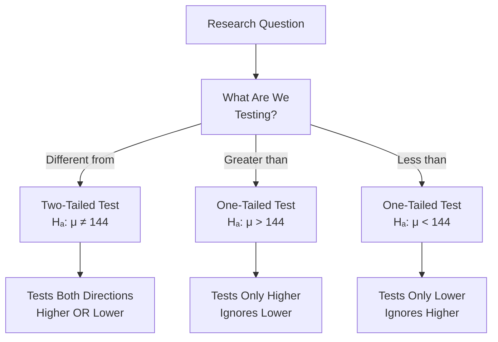
```mermaid
flowchart TD
    A[Research Question] --> B["What Are We<br/>Testing?"]
    B -->|"Different from"| C["Two-Tailed Test<br/>Hₐ: μ ≠ 144"]
    B -->|"Greater than"| D["One-Tailed Test<br/>Hₐ: μ > 144"]
    B -->|"Less than"| E["One-Tailed Test<br/>Hₐ: μ < 144"]
    C --> F["Tests Both Directions<br/>Higher OR Lower"]
    D --> G["Tests Only Higher<br/>Ignores Lower"]
    E --> H["Tests Only Lower<br/>Ignores Higher"]
```

6. **What if we had a specific direction in mind? When would one-tailed be better?**
   - If you only care about one direction (e.g., "Is usage MORE than claimed?"), one-tailed is more powerful for that direction. But you'd miss if it's actually less.

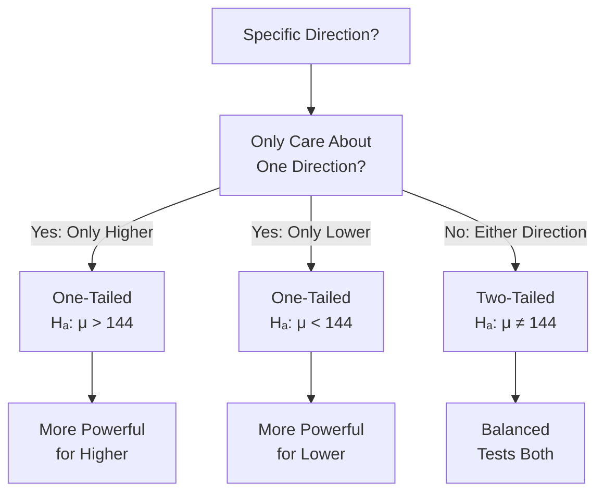
```mermaid
graph TD
    A[Specific Direction?] --> B["Only Care About<br/>One Direction?"]
    B -->|Yes: Only Higher| C["One-Tailed<br/>Hₐ: μ > 144"]
    B -->|Yes: Only Lower| D["One-Tailed<br/>Hₐ: μ < 144"]
    B -->|No: Either Direction| E["Two-Tailed<br/>Hₐ: μ ≠ 144"]
    C --> F["More Powerful<br/>for Higher"]
    D --> G["More Powerful<br/>for Lower"]
    E --> H["Balanced<br/>Tests Both"]
```

### Significance Level

7. **Why choose α = 0.05? Why not 0.01 or 0.10?**
   - 0.05 is conventional compromise: 90% too lenient (more false positives), 99% too strict (harder to detect real effects). 0.05 balances Type I and Type II errors reasonably.

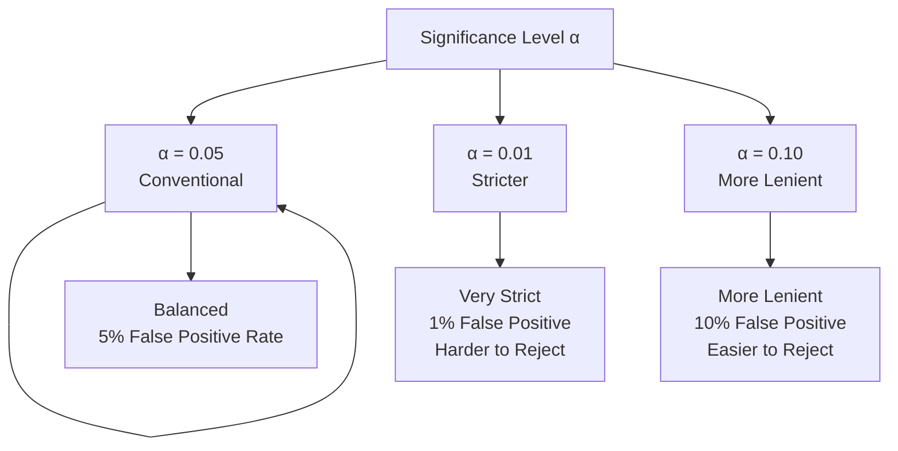
```mermaid
flowchart TD
    A["Significance Level α"] --> B[α = 0.05<br/>Conventional] --> B["α = 0.05<br/>Conventional"]
    A --> C["α = 0.01<br/>Stricter"]
    A --> D["α = 0.10<br/>More Lenient"]
    B --> E["Balanced<br/>5% False Positive Rate"]
    C --> F["Very Strict<br/>1% False Positive<br/>Harder to Reject"]
    D --> G["More Lenient<br/>10% False Positive<br/>Easier to Reject"]
```

8. **What happens if we change α after seeing the p-value?**
   - That's p-hacking! Choosing α after seeing results allows cherry-picking. Must set α before analysis to maintain proper error rate control.

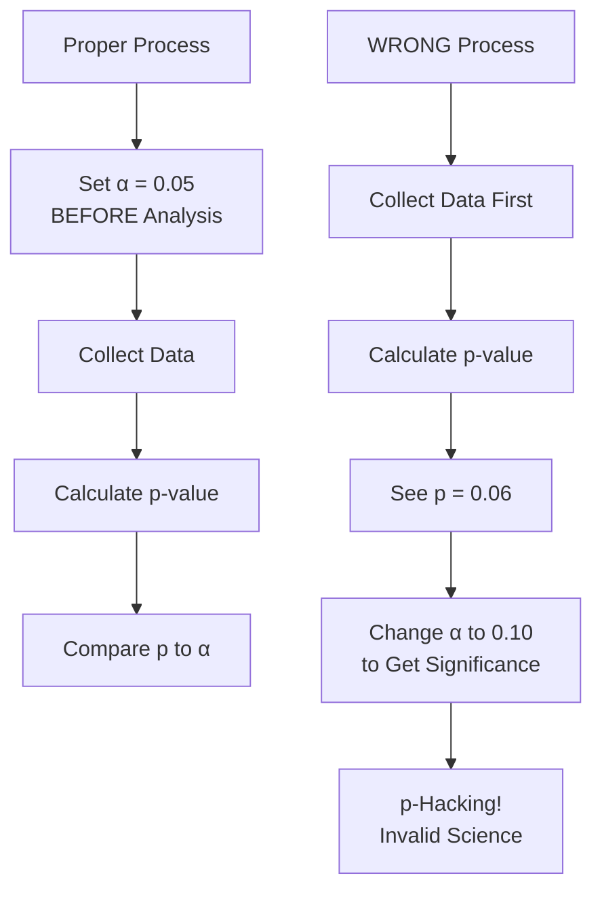
```mermaid
graph TD
    A[Proper Process] --> B["Set α = 0.05<br/>BEFORE Analysis"]
    B --> C[Collect Data]
    C --> D[Calculate p-value]
    D --> E["Compare p to α"]
    F[WRONG Process] --> G[Collect Data First]
    G --> H[Calculate p-value]
    H --> I["See p = 0.06"]
    I --> J["Change α to 0.10<br/>to Get Significance"]
    J --> K["p-Hacking!<br/>Invalid Science"]
```

## Z-TEST vs T-TEST

### Understanding the Difference

9. **Why use Z-test when population standard deviation (σ = 110) is known?**
   - When σ is known, we can use the exact standard error (σ/√n). Z-test uses this known value, giving exact probabilities. More precise than estimating σ from sample.

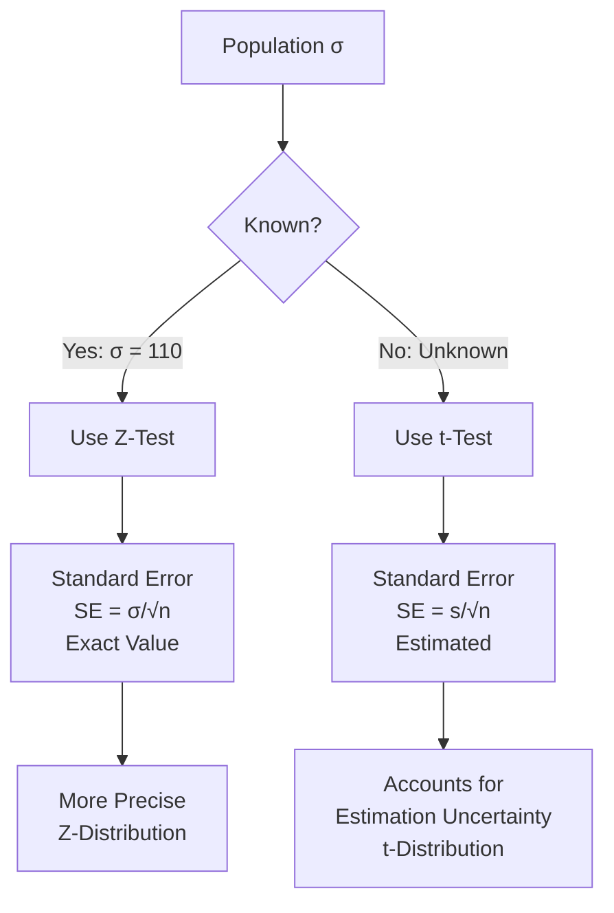
```mermaid
flowchart TD
    A["Population σ"] --> B{Known?}
    B -->|Yes: σ = 110| C[Use Z-Test]
    B -->|No: Unknown| D[Use t-Test]
    C --> E["Standard Error<br/>SE = σ/√n<br/>Exact Value"]
    D --> F["Standard Error<br/>SE = s/√n<br/>Estimated"]
    E --> G["More Precise<br/>Z-Distribution"]
    F --> H["Accounts for<br/>Estimation Uncertainty<br/>t-Distribution"]
```

10. **Why does t-test give different p-value (0.169) than Z-test (0.069)?**
    - t-test accounts for estimating σ from sample (extra uncertainty). t-distribution has fatter tails than normal, giving larger p-values. More conservative, accounts for unknown σ.

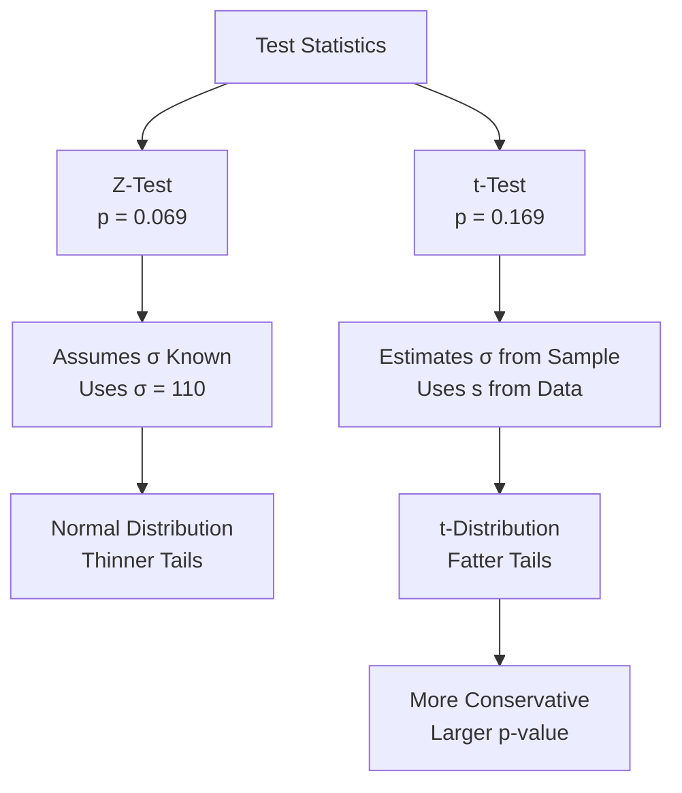
```mermaid
graph TD
    A[Test Statistics] --> B["Z-Test<br/>p = 0.069"]
    A --> C["t-Test<br/>p = 0.169"]
    B --> D["Assumes σ Known<br/>Uses σ = 110"]
    C --> E["Estimates σ from Sample<br/>Uses s from Data"]
    D --> F["Normal Distribution<br/>Thinner Tails"]
    E --> G["t-Distribution<br/>Fatter Tails"]
    G --> H["More Conservative<br/>Larger p-value"]
```

11. **When is it realistic to know population standard deviation σ?**
    - Rarely! Usually only in: (1) theoretical scenarios, (2) very well-studied populations with extensive historical data, (3) standardized tests. Most real problems use t-test.

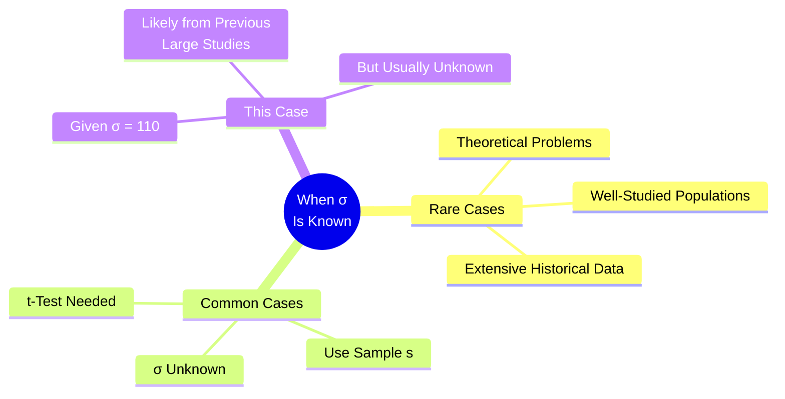
```mermaid
mindmap
    root((When σ<br/>Is Known))
        Rare Cases
            Theoretical Problems
            Well-Studied Populations
            Extensive Historical Data
        Common Cases
            σ Unknown
            Use Sample s
            t-Test Needed
        This Case
            Given σ = 110
            Likely from Previous<br/>Large Studies
            But Usually Unknown
```

12. **Why does sample size (n=30) matter for choosing Z vs t?**
    - With large n (n≥30), t-distribution approaches normal, so Z and t give similar results. With small n, t is more appropriate. Rule of thumb: n≥30 for CLT, but t-test still better when σ unknown.

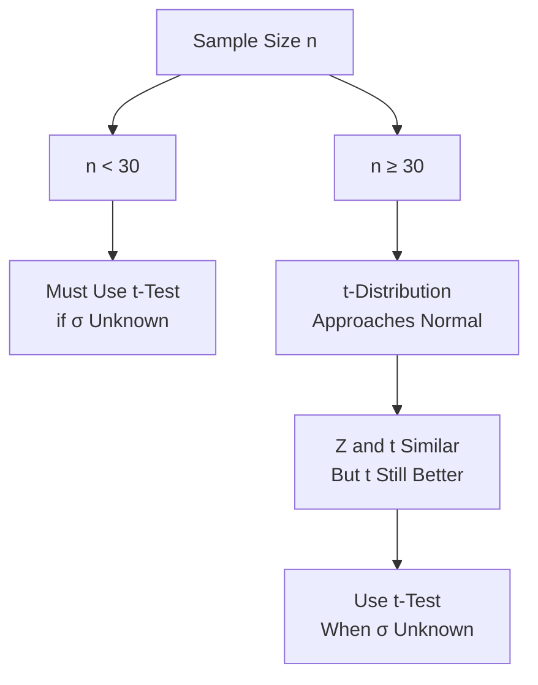
```mermaid
flowchart TD
    A[Sample Size n] --> B["n < 30"]
    A --> C["n ≥ 30"]
    B --> D["Must Use t-Test<br/>if σ Unknown"]
    C --> E["t-Distribution<br/>Approaches Normal"]
    E --> F["Z and t Similar<br/>But t Still Better"]
    F --> G["Use t-Test<br/>When σ Unknown"]
```

## TEST STATISTICS AND P-VALUES

### Understanding Calculations

13. **What does z-statistic = 1.82 actually measure?**
    - It measures how many standard errors the sample mean (x̄) is away from hypothesized mean (144). z=1.82 means sample mean is 1.82 standard errors above 144.

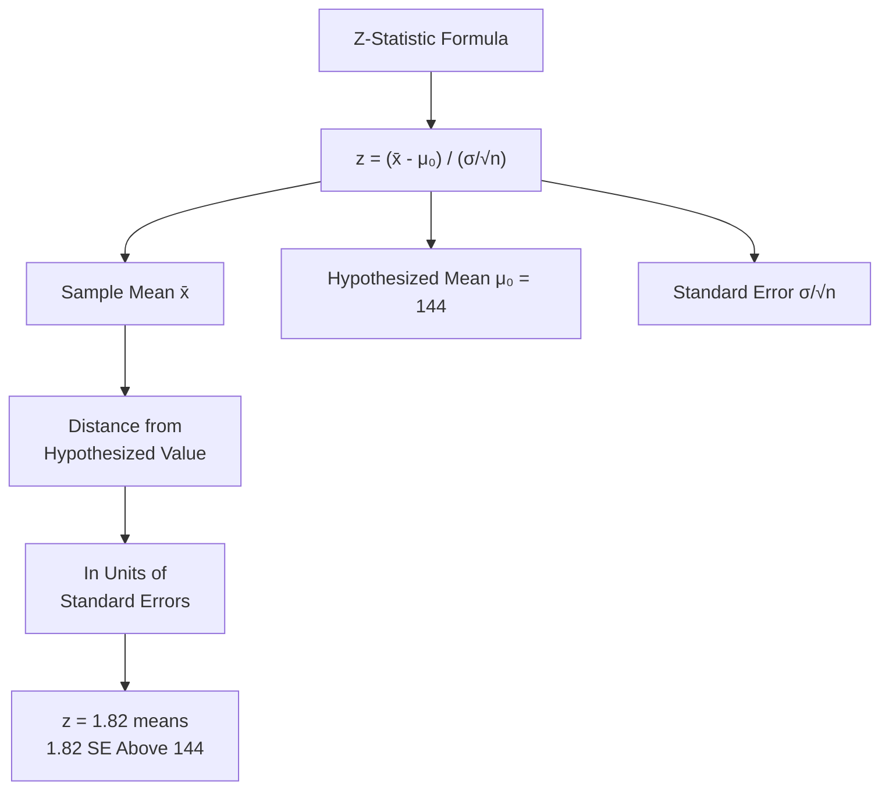
```mermaid
graph TD
    A[Z-Statistic Formula] --> B["z = (x̄ - μ₀) / (σ/√n)"]
    B --> C[Sample Mean x̄]
    B --> D["Hypothesized Mean μ₀ = 144"]
    B --> E["Standard Error σ/√n"]
    C --> F["Distance from<br/>Hypothesized Value"]
    F --> G["In Units of<br/>Standard Errors"]
    G --> H["z = 1.82 means<br/>1.82 SE Above 144"]
```

14. **Why multiply one-tailed p-value by 2 for two-tailed test?**
    - Two-tailed tests both directions. If z=1.82, probability of being ≥1.82 OR ≤-1.82. By symmetry, P(≥1.82) = P(≤-1.82), so double the one-tailed probability.

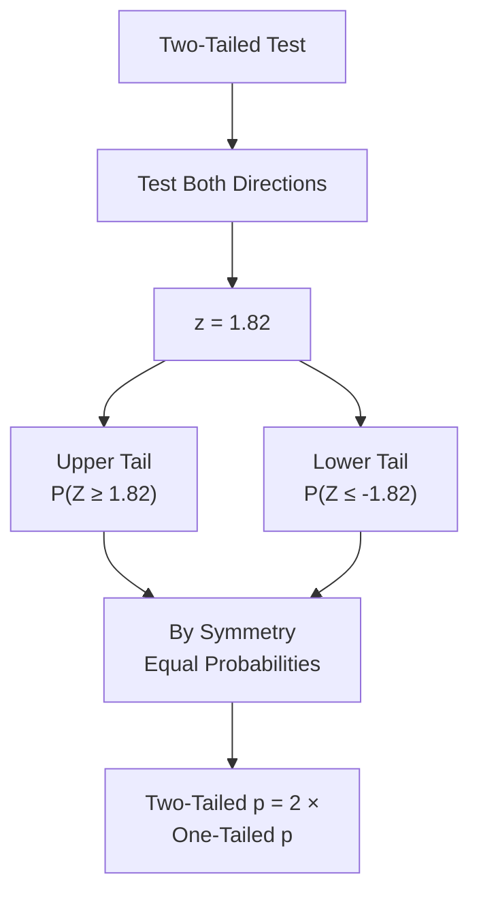
```mermaid
flowchart TD
    A[Two-Tailed Test] --> B[Test Both Directions]
    B --> C["z = 1.82"]
    C --> D["Upper Tail<br/>P(Z ≥ 1.82)"]
    C --> E["Lower Tail<br/>P(Z ≤ -1.82)"]
    D --> F["By Symmetry<br/>Equal Probabilities"]
    E --> F
    F --> G["Two-Tailed p = 2 ×<br/>One-Tailed p"]
```

15. **What does p-value = 0.069 mean in practical terms?**
    - If true mean is 144, there's 6.9% chance of getting sample mean as extreme (or more) as observed. Not very unlikely, so insufficient evidence to reject claim.

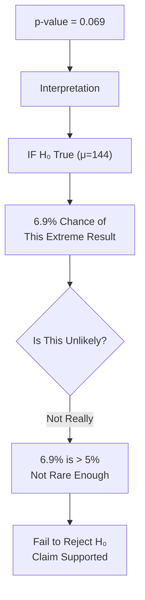
```mermaid
graph TD
    A["p-value = 0.069"] --> B[Interpretation]
    B --> C["IF H₀ True (μ=144)"]
    C --> D["6.9% Chance of<br/>This Extreme Result"]
    D --> E{Is This Unlikely?}
    E -->|Not Really| F["6.9% is > 5%<br/>Not Rare Enough"]
    F --> G["Fail to Reject H₀<br/>Claim Supported"]
```

16. **Why is p-value = 0.169 from t-test larger than 0.069 from Z-test?**
    - t-distribution has fatter tails (more spread) than normal. Same test statistic gives larger p-value because extreme values are more likely under t-distribution.

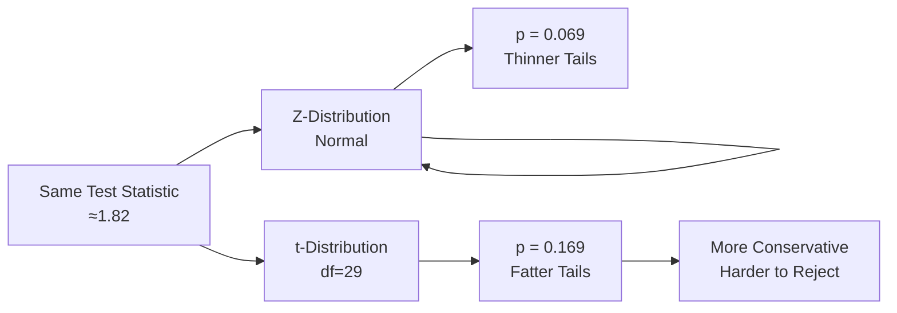
```mermaid
graph LR
    A["Same Test Statistic<br/>≈1.82"] --> B[Z-Distribution<br/>Normal] --> B["Z-Distribution<br/>Normal"]
    A --> C["t-Distribution<br/>df=29"]
    B --> D["p = 0.069<br/>Thinner Tails"]
    C --> E["p = 0.169<br/>Fatter Tails"]
    E --> F["More Conservative<br/>Harder to Reject"]
```

## DECISION MAKING

### Interpreting Results

17. **What does "fail to reject H₀" mean? Does it prove μ = 144?**
    - No! It means insufficient evidence against the claim. Could be true, or sample too small to detect difference. "Fail to reject" ≠ "accept" or "prove".

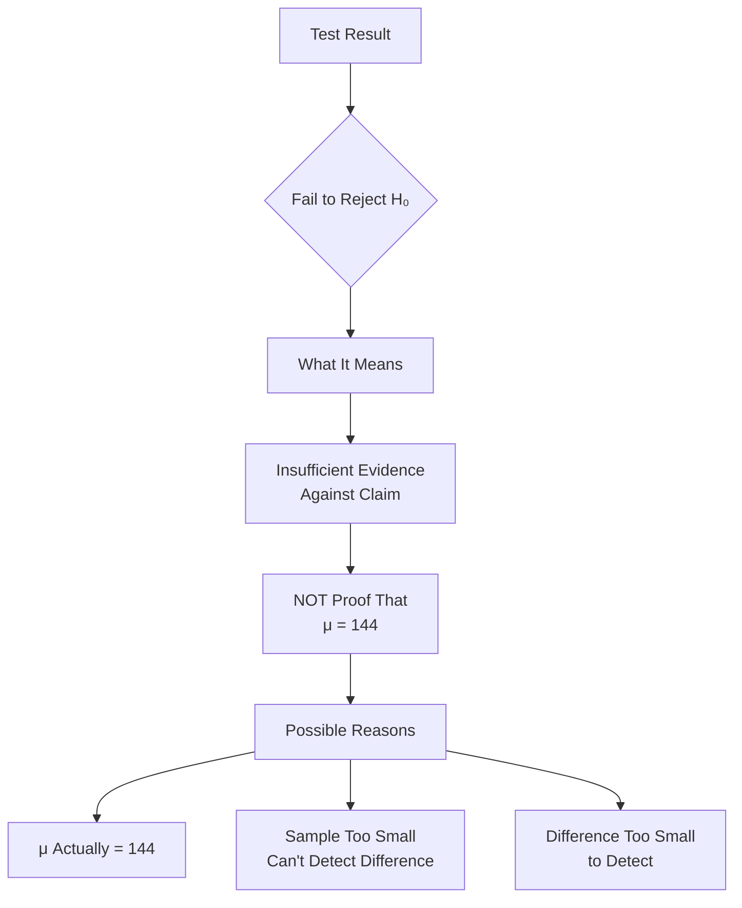
```mermaid
flowchart TD
    A[Test Result] --> B{Fail to Reject H₀}
    B --> C[What It Means]
    C --> D["Insufficient Evidence<br/>Against Claim"]
    D --> E["NOT Proof That<br/>μ = 144"]
    E --> F[Possible Reasons]
    F --> G["μ Actually = 144"]
    F --> H["Sample Too Small<br/>Can't Detect Difference"]
    F --> I["Difference Too Small<br/>to Detect"]
```

18. **Why can't we "accept" the null hypothesis?**
    - Statistics deals with probability, not proof. We can show evidence against H₀, but can't prove it's true. "Accept" implies certainty we don't have.

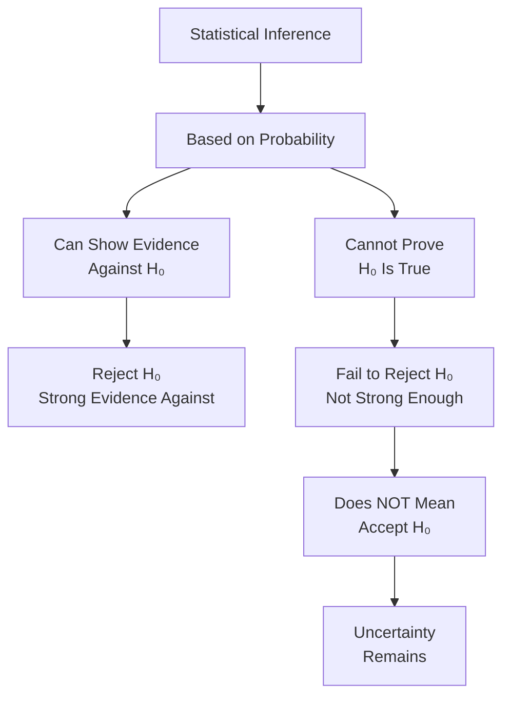
```mermaid
graph TD
    A[Statistical Inference] --> B[Based on Probability]
    B --> C["Can Show Evidence<br/>Against H₀"]
    B --> D["Cannot Prove<br/>H₀ Is True"]
    C --> E["Reject H₀<br/>Strong Evidence Against"]
    D --> F["Fail to Reject H₀<br/>Not Strong Enough"]
    F --> G["Does NOT Mean<br/>Accept H₀"]
    G --> H["Uncertainty<br/>Remains"]
```

19. **What if p-value was 0.03 instead of 0.069? How would conclusion change?**
    - p=0.03 < α=0.05, so we'd reject H₀. Conclude population mean is different from 144 minutes. Strong evidence against the company's claim.

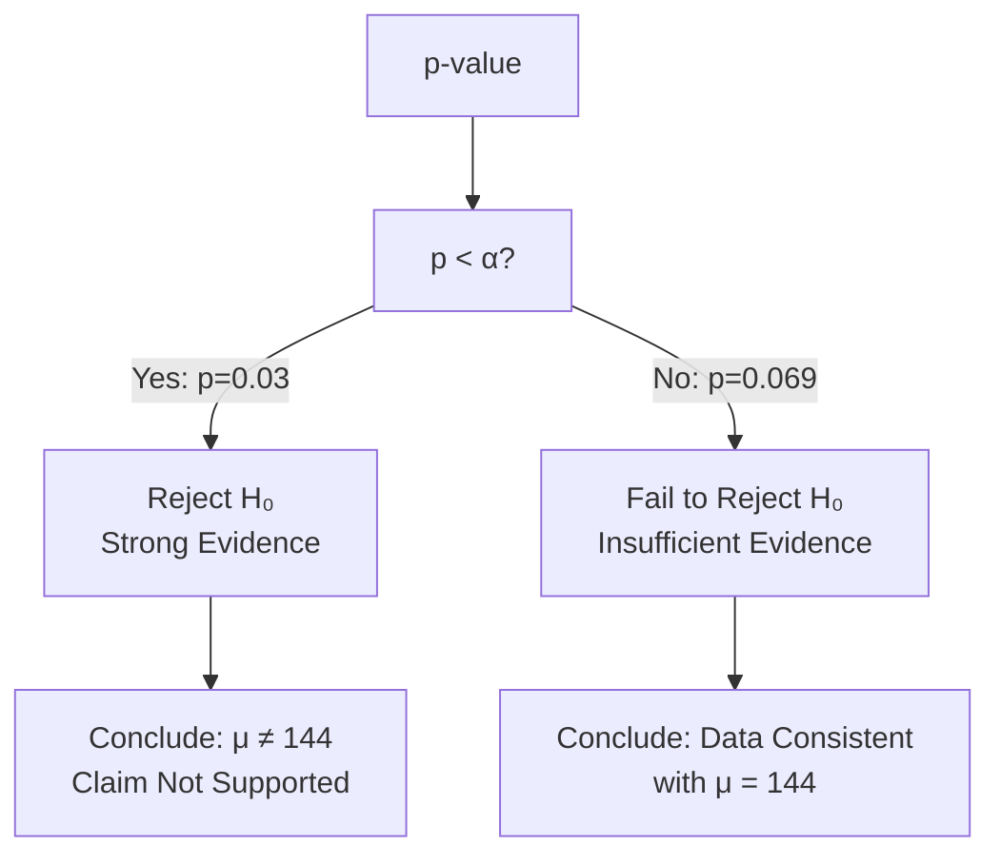
```mermaid
flowchart TD
    A[p-value] --> B["p < α?"]
    B -->|Yes: p=0.03| C["Reject H₀<br/>Strong Evidence"]
    B -->|No: p=0.069| D["Fail to Reject H₀<br/>Insufficient Evidence"]
    C --> E["Conclude: μ ≠ 144<br/>Claim Not Supported"]
    D --> F["Conclude: Data Consistent<br/>with μ = 144"]
```

20. **How does sample mean being different from 144 not guarantee rejection?**
    - Difference must be statistically significant, not just numerically different. Small differences can occur by chance. Test statistic and p-value account for sampling variability.

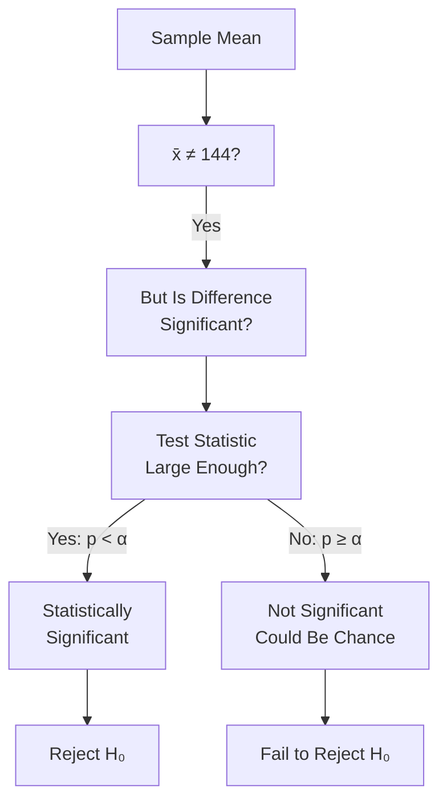
```mermaid
graph TD
    A[Sample Mean] --> B["x̄ ≠ 144?"]
    B -->|Yes| C["But Is Difference<br/>Significant?"]
    C --> D["Test Statistic<br/>Large Enough?"]
    D -->|Yes: p < α| E["Statistically<br/>Significant"]
    D -->|No: p ≥ α| F["Not Significant<br/>Could Be Chance"]
    E --> G[Reject H₀]
    F --> H[Fail to Reject H₀]
```

## ASSUMPTIONS AND CONDITIONS

### Critical Assumptions

21. **Why assume population is normally distributed? Is this realistic?**
    - Needed for Z/t-tests to be valid. With n=30, CLT helps, but extreme skewness still problematic. Check with histogram/Q-Q plot. Often reasonable approximation.

```mermaid
flowchart TD
    A[Normality Assumption] --> B["Is Population<br/>Normal?"]
    B -->|Perfect| C[Z/t-Tests Exact]
    B -->|Approximate| D["Z/t-Tests Valid<br/>by CLT"]
    B -->|Highly Skewed| E[Problem!]
    D --> F["n=30 Helps<br/>Sample Mean Normal"]
    E --> G["Need Transformations<br/>or Non-Parametric"]
```

22. **What if the sample isn't random? How does that affect the test?**
    - Non-random sampling introduces bias. If friends/family aren't representative, test results don't apply to population. Conclusions become invalid for all Americans.

```mermaid
graph TD
    A[Random Sampling] --> B{Critical Assumption}
    B --> C{Random?}
    C -->|Yes| D["Valid Inference<br/>Results Generalize"]
    C -->|No: Biased| E[Invalid Inference]
    E --> F[Example: All Tech-Savvy]
    F --> G[Overestimate Usage]
    G --> H["Wrong Conclusions<br/>About Population"]
```

23. **Why assume independence between observations?**
    - If one person's usage affects another's (e.g., family plan limits), observations aren't independent. Violates test assumptions, making p-values and conclusions invalid.

```mermaid
flowchart TD
    A[Independence Assumption] --> B["Are Observations<br/>Independent?"]
    B -->|Yes| C["Valid Test<br/>Each Person Separate"]
    B -->|No| D[Violation!]
    D --> E["Example: Family Plan<br/>Shared Data Limits"]
    E --> F["One Person's Usage<br/>Affects Others"]
    F --> G["Invalid p-values<br/>Wrong Conclusions"]
```

24. **What if sample size was 10 instead of 30? Would test still work?**
    - With n=10, t-test still works but less powerful. Harder to detect real differences. Confidence intervals wider. Still valid if assumptions met, just less informative.

```mermaid
graph TD
    A[Sample Size] --> B["n = 10"]
    A --> C["n = 30"]
    B --> D["Less Powerful<br/>Harder to Detect Differences"]
    B --> E["Wider Confidence<br/>Intervals"]
    B --> F["Still Valid if<br/>Assumptions Met"]
    C --> G["More Powerful<br/>Easier to Detect"]
    C --> H["Narrower Confidence<br/>Intervals"]
```

## REAL-WORLD INTERPRETATION

### Business Implications

25. **What does "data consistent with 144 minutes" mean for the company?**
    - Sample doesn't contradict their claim. They can continue using 144 minutes in marketing/materials. But doesn't prove it's exactly 144 - just not disproven.

```mermaid
flowchart TD
    A[Test Result] --> B[Fail to Reject H₀]
    B --> C["Data Consistent<br/>with Claim"]
    C --> D[Business Implications]
    D --> E["Can Use 144 min<br/>in Marketing"]
    D --> F["Continue Current<br/>Strategies"]
    D --> G["But NOT Proof<br/>of Exact Value"]
```

26. **How would conclusion change if we tested "greater than 144" instead of "different"?**
    - One-tailed test (μ > 144) would have p-value = 0.0345 (half of 0.069). Might reject H₀ if using one-tailed, but two-tailed is more appropriate for "different".

```mermaid
graph TD
    A[Hypothesis Type] --> B["Two-Tailed<br/>μ ≠ 144"]
    A --> C["One-Tailed<br/>μ > 144"]
    B --> D["p = 0.069<br/>Fail to Reject"]
    C --> E["p = 0.0345<br/>Might Reject"]
    E --> F["But Less Appropriate<br/>for Different"]
    D --> G["More Conservative<br/>Tests Both Directions"]
```

27. **What if sample mean was 200 minutes instead of observed value?**
    - Much larger difference from 144. Test statistic would be larger, p-value smaller. More likely to reject H₀ and conclude mean is different from 144.

```mermaid
flowchart TD
    A[Sample Mean] --> B["x̄ = 200<br/>vs μ₀ = 144"]
    B --> C["Large Difference<br/>56 minutes"]
    C --> D[Larger Test Statistic]
    D --> E[Smaller p-value]
    E --> F["p < 0.05?"]
    F -->|Likely Yes| G["Reject H₀<br/>Strong Evidence"]
    F -->|If No| H["Still Fail to Reject<br/>But Closer"]
```

28. **How does population standard deviation (σ = 110) affect the test?**
    - Large σ (110 minutes) means high variability. Makes it harder to detect differences - need larger sample mean differences to be significant. Wider confidence intervals.

```mermaid
graph TD
    A["Population σ = 110"] --> B[Large Variability]
    B --> C["High Spread<br/>in Usage Times"]
    C --> D["Standard Error<br/>SE = 110/√30 ≈ 20"]
    D --> E["Wider Distribution<br/>of Sample Means"]
    E --> F["Harder to Detect<br/>Differences"]
    F --> G["Need Larger<br/>Sample Differences"]
```

## STATISTICAL POWER AND SAMPLE SIZE

### Understanding Limitations

29. **Why might we fail to reject even if true mean isn't 144?**
    - Low statistical power: sample too small, difference too small, or variability too high. Test can't detect real differences. Need larger sample or accept we might miss differences.

```mermaid
mindmap
    root((Why Fail to<br/>Reject When<br/>Wrong?))
        Low Power
            Small Sample Size
            Small Effect Size
            High Variability
        Consequences
            Type II Error
            Miss Real Differences
            False Negative
        Solutions
            Increase Sample Size
            Accept Limitations
            Report Power Analysis
```

30. **What sample size would give us 80% power to detect a 20-minute difference?**
    - Power analysis calculates required n. For 20-min difference, σ=110, α=0.05, power=0.80, need larger sample (typically n>100). Current n=30 has low power.

```mermaid
flowchart TD
    A[Power Analysis] --> B[Specify Parameters]
    B --> C[Effect Size: 20 min]
    B --> D["σ = 110"]
    B --> E["α = 0.05"]
    B --> F["Power = 0.80"]
    C & D & E & F --> G[Calculate Required n]
    G --> H["n > 100<br/>Typically Needed"]
    I["Current n = 30"] --> J[Low Power<br/>Might Miss Differences] --> J["Low Power<br/>Might Miss Differences"]
```

31. **How does effect size (difference from 144) affect our ability to detect it?**
    - Larger differences easier to detect (higher power). Small differences (e.g., 5 minutes) need huge samples. Current test might miss small but real differences.

```mermaid
graph TD
    A[Effect Size] --> B[Large: 50+ min]
    A --> C[Medium: 20 min]
    A --> D[Small: 5 min]
    B --> E["Easy to Detect<br/>High Power"]
    C --> F["Moderate Power<br/>Need Larger n"]
    D --> G["Hard to Detect<br/>Need Very Large n"]
    H["n = 30"] --> I[Might Miss<br/>Small Differences] --> I["Might Miss<br/>Small Differences"]
```

## COMPARING Z AND T TESTS

### Practical Differences

32. **Why do Z and t tests give different conclusions in this case?**
    - They actually give same conclusion (both fail to reject), but different p-values. Z-test more optimistic (p=0.069), t-test more conservative (p=0.169). t-test is more appropriate.

```mermaid
flowchart TD
    A[Test Comparison] --> B["Z-Test<br/>p = 0.069"]
    A --> C["t-Test<br/>p = 0.169"]
    B --> D["Same Conclusion<br/>Fail to Reject"]
    C --> D
    B --> E["More Optimistic<br/>Closer to Rejection"]
    C --> F["More Conservative<br/>Accounts for Uncertainty"]
    F --> G["t-Test More<br/>Appropriate"]
```

33. **When should we trust Z-test results vs t-test results?**
    - Trust t-test when σ unknown (most real cases). Z-test only valid when σ truly known (rare). In this case, even though σ given, t-test is safer if σ might be wrong.

```mermaid
graph TD
    A[Which Test to Trust?] --> B["σ Truly Known<br/>with Certainty?"]
    B -->|Yes: Rare| C["Z-Test Valid<br/>More Precise"]
    B -->|No: Common| D["t-Test Valid<br/>More Conservative"]
    B -->|Uncertain| E["Use t-Test<br/>Safer Choice"]
    E --> F["Accounts for<br/>Estimation Uncertainty"]
```

34. **What if population standard deviation was estimated from previous large study?**
    - If σ=110 from large study, it's still an estimate (not truly known). Should use t-test or account for uncertainty. Z-test assumes σ known exactly, which is rarely true.

```mermaid
flowchart TD
    A["σ = 110 Source"] --> B{How Obtained?}
    B -->|Large Previous Study| C["Still an Estimate<br/>Not Truly Known"]
    B -->|Theoretical Value| D["Truly Known<br/>Rare"]
    C --> E["Use t-Test<br/>or Account for<br/>Uncertainty"]
    D --> F[Z-Test Valid]
    E --> G["More Realistic<br/>Approach"]
```

## INTERPRETING P-VALUES CORRECTLY

### Common Misconceptions

35. **Does p-value = 0.069 mean there's 6.9% chance the claim is true?**
    - No! p-value is P(data | H₀ true), not P(H₀ true | data). It's probability of data given claim is true, not probability claim is true given data.

```mermaid
graph TD
    A["p-value = 0.069"] --> B[Common Misconception]
    B --> C["WRONG: 6.9% chance<br/>claim is true"]
    A --> D[Correct Interpretation]
    D --> E["IF claim true (μ=144)<br/>6.9% chance of<br/>this extreme data"]
    E --> F["NOT: 6.9% chance<br/>claim is true"]
```

36. **What's the difference between statistical significance and practical significance?**
    - Statistical: p < α (unlikely due to chance). Practical: difference matters in real world. Can have statistical significance without practical importance (large n, tiny difference).

```mermaid
flowchart TD
    A[Significance Types] --> B[Statistical]
    A --> C[Practical]
    B --> D["p < α<br/>Unlikely by Chance"]
    C --> E["Difference Matters<br/>in Real World"]
    D --> F{Both Present?}
    E --> F
    F -->|Yes| G[Meaningful Finding]
    F -->|Statistical Only| H["Large n, Tiny Difference<br/>Not Important"]
    F -->|Neither| I[No Evidence]
```

37. **Why can't we say "we accept the alternative hypothesis"?**
    - We reject H₀, which supports Hₐ, but can't "accept" Hₐ with certainty. Statistics provides evidence, not proof. "Reject H₀ in favor of Hₐ" is more accurate.

```mermaid
graph TD
    A[Test Result] --> B{Reject H₀?}
    B -->|Yes| C[Evidence Supports Hₐ]
    B -->|No| D[Insufficient Evidence]
    C --> E["Can Say: Evidence<br/>Supports Hₐ"]
    C --> F["Cannot Say: Accept Hₐ<br/>Implies Certainty"]
    F --> G["Uncertainty Remains<br/>Probability-Based"]
```

## SAMPLE SIZE AND VARIABILITY

### Understanding Impact

38. **How does high variability (σ = 110) make testing harder?**
    - High variability means sample means vary widely. Harder to distinguish true difference from random variation. Need larger differences or larger samples to detect effects.

```mermaid
flowchart TD
    A["High Variability<br/>σ = 110"] --> B[Wide Spread<br/>in Population] --> B["Wide Spread<br/>in Population"]
    B --> C["Sample Means<br/>Vary Widely"]
    C --> D[Hard to Distinguish]
    D --> E["True Difference vs<br/>Random Variation"]
    E --> F["Need Larger<br/>Sample Differences"]
    F --> G["Or Larger<br/>Sample Size"]
```

39. **What if we had n = 300 instead of n = 30?**
    - Larger sample gives more power, narrower confidence intervals, more precise estimates. More likely to detect real differences. But still need to check if difference is practically important.

```mermaid
graph TD
    A[Sample Size] --> B["n = 30"]
    A --> C["n = 300"]
    B --> D["Lower Power<br/>Wider CI"]
    C --> E["Higher Power<br/>Narrower CI"]
    E --> F["More Likely to<br/>Detect Differences"]
    F --> G["But Check Practical<br/>Significance"]
```

40. **Why is standard error (σ/√n) important for hypothesis testing?**
    - Standard error measures variability of sample mean. Smaller SE (larger n or smaller σ) means more precise estimates. Test statistic uses SE to standardize the difference.

```mermaid
graph TD
    A["Standard Error<br/>SE = σ/√n"] --> B[Measures Variability<br/>of Sample Mean] --> B["Measures Variability<br/>of Sample Mean"]
    B --> C["Smaller SE =<br/>More Precise"]
    C --> D[Ways to Reduce SE]
    D --> E["Increase n<br/>Larger Sample"]
    D --> F["Decrease σ<br/>Less Variability"]
    E --> G[More Powerful Test]
    F --> G
```

## BUSINESS DECISION MAKING

### Real-World Applications

41. **How should the company use these test results for marketing?**
    - Results support their claim (fail to reject). Can use 144 minutes in marketing, but should acknowledge it's an average with variability. Don't claim it's exact for everyone.

```mermaid
flowchart TD
    A[Test Results] --> B[Fail to Reject H₀]
    B --> C[Marketing Use]
    C --> D["Can Claim: Average<br/>144 minutes/day"]
    C --> E["Must Acknowledge:<br/>Variability Exists"]
    E --> F["Not Exact for<br/>Everyone"]
    D --> G["Honest Marketing<br/>Based on Data"]
```

42. **What if test had rejected H₀? How would that change business strategy?**
    - Rejection means claim not supported. Company should: (1) update claim to actual mean, (2) investigate why claim was wrong, (3) adjust marketing/product strategies accordingly.

```mermaid
graph TD
    A[If Reject H₀] --> B[Claim Not Supported]
    B --> C[Business Actions]
    C --> D["Update Claim<br/>to Actual Mean"]
    C --> E["Investigate Why<br/>Claim Wrong"]
    C --> F["Adjust Marketing<br/>Strategies"]
    C --> G["Revise Product<br/>Development"]
```

43. **How do confidence intervals complement hypothesis testing?**
    - CI shows range of plausible values for μ. If 144 is in CI, consistent with data (matches fail to reject). CI gives effect size, not just significance. More informative than test alone.

```mermaid
flowchart LR
    A[Hypothesis Test] --> B["Significance<br/>p-value"]
    C[Confidence Interval] --> D["Effect Size<br/>Range of Values"]
    B --> E["Is Difference<br/>Significant?"]
    D --> F["What Values<br/>Are Plausible?"]
    E & F --> G[Complete Picture]
    G --> H["If 144 in CI<br/>Consistent with Data"]
```

## ADVANCED CONSIDERATIONS

### Going Deeper

44. **What if data showed extreme outliers? How would that affect the test?**
    - Outliers can skew mean and inflate standard deviation. Test results become unreliable. Should investigate outliers, consider robust methods, or report results with/without outliers.

```mermaid
flowchart TD
    A[Data with Outliers] --> B{Impact on Test?}
    B --> C[Skew Sample Mean]
    B --> D["Inflate Standard<br/>Deviation"]
    C --> E["Unreliable<br/>Test Results"]
    D --> E
    E --> F[Actions]
    F --> G[Investigate Outliers]
    F --> H["Consider Robust<br/>Methods"]
    F --> I["Report With/Without<br/>Outliers"]
```

45. **How does the Central Limit Theorem justify using Z/t-tests with n=30?**
    - CLT says sample means approach normal distribution as n increases. With n=30, even if population isn't normal, sample mean distribution is approximately normal, making tests valid.

```mermaid
graph TD
    A[Central Limit Theorem] --> B["Sample Means<br/>Approach Normal"]
    B --> C[As n Increases]
    C --> D["n = 30<br/>Usually Sufficient"]
    D --> E["Sample Mean<br/>~ Normal"]
    E --> F["Z/t-Tests Valid<br/>Even if Population<br/>Not Normal"]
```

46. **What if we tested multiple claims simultaneously? How does that affect α?**
    - Testing multiple hypotheses increases overall Type I error rate. Need multiple testing correction (Bonferroni, FDR). Each test at α=0.05, but overall error rate higher.

```mermaid
flowchart TD
    A[Multiple Tests] --> B["Test 1: α = 0.05"]
    A --> C["Test 2: α = 0.05"]
    A --> D["Test 3: α = 0.05"]
    B & C & D --> E["Overall Type I Error<br/>> 5%"]
    E --> F[Need Correction]
    F --> G["Bonferroni:<br/>α/m per test"]
    F --> H[FDR Control]
```

47. **How would Bayesian approach differ from this frequentist hypothesis test?**
    - Bayesian: update prior beliefs with data, get probability of hypotheses. Frequentist: assume H₀ true, calculate probability of data. Different philosophy, different interpretations.

```mermaid
graph TD
    A[Statistical Approach] --> B[Frequentist]
    A --> C[Bayesian]
    B --> D["Assume H₀ True<br/>P(data | H₀)"]
    B --> E[p-value]
    C --> F["Prior Beliefs<br/>Update with Data"]
    C --> G["P(H₀ | data)<br/>Posterior Probability"]
    D --> H[Current Approach]
    F --> I[Alternative Approach]
```

## CONNECTING TO PREVIOUS CONCEPTS

### Integration

48. **How does this hypothesis test relate to confidence intervals we learned earlier?**
    - They're complementary! If 144 is outside 95% CI, we'd reject H₀ at α=0.05. If 144 is inside CI, we'd fail to reject. CI shows all values we'd fail to reject.

```mermaid
flowchart TD
    A[95% Confidence Interval] --> B{Does It Contain 144?}
    B -->|Yes| C["Fail to Reject H₀<br/>at α = 0.05"]
    B -->|No| D["Reject H₀<br/>at α = 0.05"]
    E[Hypothesis Test] --> F{Reject H₀?}
    F -->|No| G[144 in CI]
    F -->|Yes| H[144 Outside CI]
    C & G --> I[Consistent Results]
    D & H --> I
```

49. **How does sample size affect both hypothesis testing and confidence intervals?**
    - Larger n: more powerful tests (easier to reject), narrower CIs (more precise). Smaller n: less powerful, wider CIs. Both methods benefit from larger samples.

```mermaid
graph TD
    A[Sample Size n] --> B[Larger n]
    A --> C[Smaller n]
    B --> D["More Powerful Test<br/>Easier to Detect"]
    B --> E["Narrower CI<br/>More Precise"]
    C --> F["Less Powerful<br/>Harder to Detect"]
    C --> G["Wider CI<br/>Less Precise"]
    D & E --> H[Better Inference]
    F & G --> I[Limited Inference]
```

50. **What's the relationship between Type I error (α) and confidence level?**
    - They're complements: α = 0.05 corresponds to 95% confidence. Higher confidence (99%) means lower α (0.01), harder to reject. Lower confidence (90%) means higher α (0.10), easier to reject.

```mermaid
flowchart TD
    A[Error Rates] --> B["Type I Error α"]
    A --> C[Confidence Level]
    B --> D["α = 0.05"]
    C --> E[95% Confidence]
    D --> F["Complementary:<br/>1 - α = Confidence"]
    E --> F
    F --> G["Higher Confidence<br/>= Lower α<br/>= Harder to Reject"]
```

---

*Total Questions: 50*

**These questions cover:**
- **Fundamentals**: Hypothesis formulation, Z vs t-tests, p-values
- **Calculations**: Test statistics, standard errors, decision rules
- **Business Context**: How statistics inform marketing and strategy
- **Assumptions**: When methods break, how to verify
- **Interpretation**: Correct understanding of results
- **Integration**: How concepts connect to previous learning

Each question includes a Mermaid diagram to enhance visual learning and understanding of hypothesis testing concepts in the mobile internet usage context.
